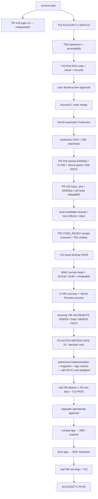

# Account C Integration Gate — 실제 구현·배포 경로

> WORK-ID: `ACCOUNT-C-INTEGRATION-GATE-01`  
> 사용자 결정: **C 계정화면 채택**  
> 제품 계약 입력: [`04-account-c-product-contract.md`](./04-account-c-product-contract.md) / `ACCOUNT-C-PRODUCT-CONTRACT-01`  
> merge-order 결정: [`02-account-c-merge-order-amendment.md`](./02-account-c-merge-order-amendment.md) / **A 승인·실행 완료**  
> 조사 기준: GitHub `bbelieff/moawork`의 2026-07-24 KST 원격 상태, 현재 `round-21` P0 계약, T04의 확정 C 제품 계약  
> 상태: **ACCOUNT C PRODUCTION_DEPLOYED / PR #19 REMOTE GREEN+HOLD / PR #20 REMOTE GREEN+MERGE HOLD / FULL P0 BLOCKED**  
> 변경 경계: 이 문서는 구현 경로를 여는 제품 artifact다. 공유 제품 코드·DB·PR·배포는 변경하지 않았다.

## 1. 결론

C 계정화면은 한 번에 전부 구현하지 않는다.

1. **`ACCOUNT-C-SAFE-01` / Product Slice 1 C shell**: 사용자와 T04 제품 계약이 정한 단일 canonical 진입 URL은 `/account`다. 이번 Safe Slice의 실제 C shell은 `/settings/account`에 두고 `/account → /settings/account` server redirect로 연결한다. 상단 사용자 메뉴, C 벤토형 읽기 요약, 마스킹된 로그인 이메일, 명시적 **현재 세션 로그아웃**만 구현하며 migration과 profile/session/tenant write는 없다.
2. **`ACCOUNT-C-P0-02`**: Global Profile/Workspace Profile 분리, Workspace 전환, 로그인 기기 목록, 모든 기기 로그아웃, 개인정보 export/delete는 `008+ expand → strict app → 009+ lockdown`과 실DB/T10을 통과한 뒤 구현한다.

Safe slice는 `main@639d629`에서 독립 구현·검수를 마치고 PR #21로 먼저 merge됐다. PR #19는 `main@ade79e7` 위에서 `AccountMenu`를 보존한 remote head `62053ba`까지 도달했고 CI #90·Vercel은 green이다. 그러나 `006` 운영 적용·실DB gate 전 Draft/merge HOLD다. PR #20도 T10 exact-SHA PASS 뒤 remote head `dc2cae`, base `62053ba`, CI #91·Vercel success까지 도달했다. 이는 remote code/preview green이며 merge·DB·Production ready가 아니다.

### 2026-07-24 release actual

| 증거 | 결과 | 증거 범위 |
|---|---|---|
| [PR #21](https://github.com/bbelieff/moawork/pull/21) | head=`4e69ec2b7434ba36f261ea1d01b4358ab8e4685c`, squash merged, merge SHA=`ade79e753ff4c99eab68b5a36bd8195245a6d57b` | GitHub connector 재확인: closed/merged, base=`main@639d629` |
| GitHub CI | run #88 completed/success | MWC release receipt. PR 본문에도 targeted 14/14, check 486, worker 14, build PASS 기록 |
| T08/T10/사용자 | T08 browser PASS, T10 final-SHA PASS, 사용자 실제 화면 승인 | PR #21 본문과 MWC release receipt |
| 원격 `main` | `ade79e753ff4c99eab68b5a36bd8195245a6d57b` | GitHub compare `main...ade79e7` status=`identical` 재확인 |
| Vercel Production | deployment=`7zcsdMk4N88GxS8pme5AtZNGqyuB`, Ready/Latest/Production/Current, source=`main@ade79e7`, domain=`www.moa-work.com` | MWC의 authenticated Vercel release receipt |
| 공개 비인증 read-back | `/account` 응답 후 `/login?next=%2Faccount` | 인증 경계 정상. 이 브라우저에는 인증 세션이 없어 post-login Account C DOM은 Production live-proven으로 주장하지 않음 |

따라서 사전 사용자 승인·release blocker는 닫혔고 collector/review 상태는 **`APPROVED / MERGED / PRODUCTION_DEPLOYED`**다. 단, 이 상태는 exact main-to-Production 결합과 비인증 auth redirect까지의 릴리스 증거다. 인증 후 Account C DOM의 Production read-back은 별도 세션 증거가 생길 때만 추가한다.

### 2026-07-24 PR #19 remote green → PR #20 active actual

| 노드 | 원격 실측 | readiness 판정 |
|---|---|---|
| PR #19 | Draft/Open/mergeable, base=`main@ade79e753ff4c99eab68b5a36bd8195245a6d57b`, head=`62053ba20dca6b6a9993f2b5cf5f0b1bc4397ef3`, 12 changed files | **REMOTE GREEN / MERGE HOLD** |
| PR #19 checks | GitHub CI run #90 completed/success, Vercel success | 코드 후보 검증 증거. `006` 실DB·Production 적용 증거 아님 |
| PR #19 금지 경계 | migration `006`/live DB/merge/Production untouched | HOLD 유지. green check로 운영 승인 대체 금지 |
| PR #20 remote relation | Draft/Open/mergeable, base branch=`feat/workspace-bootstrap`, base_sha=`62053ba20dca6b6a9993f2b5cf5f0b1bc4397ef3`, head_sha=`dc2cae7901696ef703b8e7b8a6219abb6efcdfd7`, 12 changed files | **REMOTE GREEN / MERGE HOLD** |
| remote update receipt | MWC가 old remote `5daad685906851cd1c1677ef7da88a80cb1dce66`을 재검증하고 lease 하에 exact candidate `dc2cae7901696ef703b8e7b8a6219abb6efcdfd7`로 force-push | **COMPLETED BY MWC / T02 DID NOT PUSH** |
| PR #20 local candidate | worktree=`moawork-wt-first-lead`, branch=`feat/first-lead-flow`, feature=`aa0080c690eff08aeb51fb6310608dd234dfc3cb`, final local SHA=`dc2cae7901696ef703b8e7b8a6219abb6efcdfd7`, tree=`239c2ae22aa579e84163995a61dc6982d6574919` | **CODE_READY / LOCAL_ONLY** |
| T09 receipt | `docs/implementation/PR20-POST-PR19-REBASE-01.md`, 4,485 bytes/102 lines/SHA-256=`43845F797B29CF665A77FE0F592097291F7151D1B455C35EC0DC3846BB24BFE2` | **RECEIVED / VERIFIED BY T02** |
| local validation | worktree clean, conflict 0, `git diff --check` PASS, targeted 54 PASS, app 517 PASS/기존 RLS skip 5, worker 14, lint/typecheck/build PASS, secret·PII·new skip 0 | T10 exact-SHA 입력 증거 |
| preservation·migration | AccountMenu, fail-closed entitlement, `/account` redirect, local signout 보존. `006` blob unchanged; `007`만 PR #20 migration이며 미적용 | **PRESERVED / DB UNTOUCHED** |
| T10 exact-SHA | `PR20-POST-PR19-REBASE-VERIFY-01`에서 exact `dc2cae` conflict diff·Account C preservation·targeted/full check/build·migration unchanged·secret scan. Artifact=19,340 bytes/417 lines/SHA-256=`36E3559280ACCE81F085D451F928240A55895BE7A7737EEC032181B64B5832A5` | **PASS** |
| remote checks | GitHub CI run #91=`completed/success`; Vercel Preview=`success` | **REMOTE GREEN / MERGE·DB·PRODUCTION READY 아님** |

이 delta는 GitHub connector로 PR #20의 base/head/Draft/mergeable 상태와 CI #91 `completed/success`를 다시 읽었다. T10 artifact hash·MWC lease force-push·Vercel success·운영 미적용 경계는 T09/MWC final receipt를 입력으로 삼았다. T02는 제품 코드·원격 branch·WORKLOG·DB·배포에 쓰지 않았다.

재조정 시 T02가 관찰한 T09 collector **input snapshot**은 `account-c-collector.md` 21,965 bytes/166 lines/SHA-256=`ACECF8D9E63E17DE218CF752B23B3E507C4148120F962D5A3A0CD81893E741D5`다. 증거 방향은 `T09 input snapshot → T02 integration artifact → current T09 collector hub`이며, 이 receipt를 영구 current hash로 해석하거나 downstream hub가 T02를 흡수한 뒤의 hash를 다시 추적하지 않는다. input snapshot이 지정한 다음 운영 DECISION_GATE는 **`P0-AUTHZ-WRITER-GATE-01`**이며 다섯 결정과 운영 HOLD 조건은 그대로 유효하다.

## 2. 사전 통합 기준 증거

### GitHub — release 전 baseline

아래 PR #18~#20와 `main@639d629` 표는 Account C 구현 순서를 결정할 때의 baseline이다. 현재 main 사실로 재사용하지 않는다.

| 대상 | 2026-07-24 KST 실측 | Account C 영향 |
|---|---|---|
| [`main`](https://github.com/bbelieff/moawork/tree/main) | `639d629e9c09bba63415a96d0d7d46c653fb24ac` | 계정 페이지 없음. 앱 셸 하단에 사용자 요약과 단일 로그아웃 버튼만 있음 |
| [PR #18](https://github.com/bbelieff/moawork/pull/18) | Draft/Open, base=`main`, head=`a50000b4a30d84e49782363ef11dc5625fd8cfdf` | 로그인 UI 6파일. callback/session/layout/migration 변경 없음. **독립** |
| [PR #19](https://github.com/bbelieff/moawork/pull/19) | Draft/Open, base=`main`, head=`b28a5fa4573e01154943a410b52a74ff11052dc7` | `layout.tsx`, callback, workspace service, `006` 변경. **직접 파일 충돌 1건 + profile/session 간접 계약 충돌** |
| [PR #20](https://github.com/bbelieff/moawork/pull/20) | Draft/Open, base=PR #19 head, head=`5daad685906851cd1c1677ef7da88a80cb1dce66` | 신규업체/CRM/`007`; `nav-items.ts` 한 줄 변경. Account C가 nav-items를 건드리지 않으면 **파일 독립** |

PR #19와 #20의 “mergeable” 또는 Vercel success는 실DB migration·RLS·동시성 PASS를 뜻하지 않는다. 두 PR 설명에도 실제 `006/007` 적용과 live DB 검증이 남아 있다.

### Vercel

Vercel 프로젝트 설정을 로그인된 dashboard에서 읽기 전용 확인했다.

| 항목 | 실측 |
|---|---|
| Git 연동 | `main`과 PR #18~#20 각 head에 GitHub status context `Vercel: success` 존재 |
| Production branch | `main` |
| 자동 Production | “`main` branch의 모든 commit이 Production Deployment를 생성” |
| Production domain 자동 할당 | Enabled |
| 현재 Production | release actual 기준 Environment=`Production`, `Current`, source=`main@ade79e7`, deployment=`7zcsdMk4N88GxS8pme5AtZNGqyuB` |
| 공개 read-back domain | [`https://www.moa-work.com`](https://www.moa-work.com) |
| Root Directory | `app` |
| 외부 root 파일 포함 | Enabled |
| 영향 없는 변경 skip | Enabled; Account C는 `app/**` 변경이므로 skip 대상이 아님 |
| Vercel Node | 24.x |
| GitHub CI Node | 22 (`.github/workflows/ci.yml`) |

따라서 **main merge는 자동 Production 배포 경로**다. 별도 `vercel --prod`를 실행하지 않는다. 다만 Vercel success만으로 제품 PASS를 선언하지 않고, merge SHA가 Production Current와 일치하는지와 실제 공개 URL을 다시 읽는다. Vercel의 일반 Git 배포 동작은 [공식 Git 배포 문서](https://vercel.com/docs/git), 프로젝트 설정은 [공식 Project Settings 문서](https://vercel.com/docs/project-configuration/project-settings)를 따른다.

## 3. `main`의 실제 파일·함수

| 경로 | 실제 함수/구조 | 현재 역할 | Account C 처리 |
|---|---|---|---|
| `app/src/app/(app)/layout.tsx` | `AppLayout`, `getSession`, inline initial/user summary, `<form action="/auth/signout">` | 인증 앱 셸, 하단 사용자 표시, 상단 검색/알림/theme | `AccountMenu`를 상단 우측에 삽입하고 하단 중복 signout을 제거/축소. PR #19와 merge 순서 직렬화 |
| `app/src/components/shell/SidebarNav.tsx` | `SidebarNav` | 서버에서 받은 locked feature를 표시 | 변경하지 않음 |
| `app/src/components/shell/nav-items.ts` | `NAV_ITEMS` | 좌측 업무 navigation | 변경하지 않음. Account C는 상단 사용자 메뉴 진입이므로 PR #20 충돌 회피 |
| `app/src/lib/auth/session.ts` | `getSession`, `getSessionOrNull`, `getSupabaseSession`, 내부 `findMembership`, `getDevSession`, `applyAs` | 인증 user, 선택된 org membership, role/scope를 `Ctx`로 구성 | Safe slice는 `getSession()` 읽기만 사용. membership switch/profile/session revoke를 추가하지 않음 |
| `app/src/app/auth/signout/route.ts` | `POST` | Supabase `auth.signOut()` 후 `/login` redirect, dev cookie 3종 삭제 | Safe slice에서 `signOut({ scope: "local" })`을 명시하고 route test 추가. 현재 session logout 전용으로 정의 |
| `app/src/lib/supabase/server.ts` | `createClient` | Server Component/Route/Action용 cookie-aware client | signout route의 기존 client를 재사용 |
| `app/src/lib/supabase/client.ts` | `createClient` | 브라우저 client | Safe slice에서는 불필요. 계정 page를 서버 읽기로 유지 |
| `app/src/proxy.ts` | `proxy`, 내부 `isPublicPath` | Supabase token 검증·갱신, 미인증 route guard | 변경하지 않음. `/settings/account`와 `/account`는 기존 비공개 경로로 자동 보호 |
| `app/src/app/auth/callback/route.ts` | `GET`, `loginError` | OAuth exchange, `users` upsert, membership 선택, org cookie 설정 | Safe slice에서 변경 금지. 매 로그인 profile upsert가 편집값을 덮을 수 있어 profile edit는 P0 후속 |
| `app/src/app/(app)/settings/members/page.tsx` | `MembersPage`, 내부 server action `changeRole` | LocalRepo 기반 member list/role 변경, email 원문 표시 | Account C에서 import·재사용·링크 확장 금지. 후속 `/w/[workspaceSlug]/settings/members` cutover 전까지 legacy로 격리 |
| `app/src/lib/auth/roles.ts` | `roleRank`, `atLeast`, `isManager`, `roleLabel`, `scopeLabel` | legacy 3-role 표시/판정 | menu의 기존 shell 표기를 유지할 때만 사용. 새 role 편집/권한 근거로 사용 금지 |
| `app/src/lib/auth/admin.ts` | `parseAdminRole`, fallback admin grant | legacy Platform role 합성 | Account C에 Platform role을 Workspace role로 표시하지 않음. strict app/009에서 제거 대상 |

### 현재 위험한 의미 차이

- `auth.signOut()`은 Supabase JavaScript에서 기본 scope가 `global`이다. 현재 UI의 모호한 “로그아웃” 버튼은 사실상 모든 device의 refresh token을 대상으로 할 수 있다. Safe slice는 [공식 signOut 계약](https://supabase.com/docs/reference/javascript/auth-signout)에 따라 `scope: "local"`을 명시해 **현재 세션 로그아웃**으로 고정한다.
- default global signout만으로 P0 “모든 기기 로그아웃”을 구현했다고 보지 않는다. 이미 발급된 access JWT는 만료 전까지 남을 수 있고, 현재 앱에는 session registry/epoch/cutoff와 old-JWT 서버 거부 증거가 없다.
- callback의 `users.upsert(...)`는 OAuth 재로그인마다 name/avatar를 다시 쓸 수 있다. Global/Workspace profile edit는 이 경로가 “최초 기본값만 생성”으로 바뀐 뒤에만 연다.
- `getSession`은 legacy Platform role을 Workspace role/scope에 합성할 수 있다. Safe slice는 Platform grade/role을 계정 C의 Workspace membership로 노출하지 않는다.

## 4. `ACCOUNT-C-SAFE-01` 구현 범위

### 새 파일

| 경로 | 소유 기능 |
|---|---|
| `app/src/app/(app)/settings/account/page.tsx` | Safe Slice의 실제 C 벤토 서버 page. `getSession()`으로 자기 context만 읽음 |
| `app/src/app/(app)/account/page.tsx` | 제품 canonical 진입점. `/settings/account`로 server redirect하며 별도 UI·데이터 loader를 만들지 않음 |
| `app/src/components/account/AccountMenu.tsx` | 상단 이름 있는 사용자 menu. canonical `/account` 링크와 현재 session logout form |
| `app/src/components/account/AccountOverview.tsx` | C 벤토 읽기 요약. 역할·직책·팀·Platform tier를 합성하지 않음 |
| `app/src/components/account/AccountState.tsx` | loading/empty/error/denied/blocked 공통 문법 |
| `app/src/lib/account/presentation.ts` | `maskLoginEmail`, initial/empty-value 같은 순수 표시 변환 |
| `app/src/lib/account/presentation.test.ts` | masking·빈 값·긴 이름 경계 |
| `app/src/lib/auth/account-ui.test.ts` | raw email/Platform tier·persona selector/위험 CTA 비노출, menu/route 계약 |
| `app/src/app/auth/signout/route.test.ts` | explicit local scope, redirect, cookie 삭제, signOut 오류 경로 |

### 수정 파일

| 경로 | 수정 |
|---|---|
| `app/src/app/(app)/layout.tsx` | inline 사용자/signout을 `AccountMenu`로 치환하고 상단 우측에 배치. raw email을 client props로 전달하지 않음 |
| `app/src/app/auth/signout/route.ts` | `supabase.auth.signOut({ scope: "local" })`; 오류를 성공처럼 redirect할지 여부는 test에서 명시적으로 결정하고 fail-closed 권장 |

### 화면·데이터 계약

- 단일 제품 canonical 진입 URL: `/account`; 사용자·상단 메뉴·외부 검수는 이 URL을 우선한다.
- Safe Slice 실제 화면과 local visual URL: `/settings/account`, `http://localhost:3000/settings/account`. `/account`는 이 화면으로 server redirect한다.
- 상단 사용자 메뉴는 이름·avatar/initial·현재 Workspace 이름만 우선 표시한다. Platform role은 표시하지 않는다.
- `/settings/account`: 이름, avatar, 마스킹된 로그인 이메일, current Workspace 요약을 C 벤토로 표시한다. 편집 CTA 없음.
- 고객 역할 문구는 실제 membership에서만 `대표/팀장/사원`으로 번역한다. 현재 session이 Platform role을 합성하는 경우 새 권한·tenant 성공을 표시하지 않는다. Platform principal, 1~4급, persona selector는 DOM에 렌더하지 않는다.
- 장기 `/w/[workspaceSlug]/profile`은 이번 Safe Slice에서 성공 route로 만들지 않는다. slug/profile schema와 active membership server loader가 준비되지 않았으므로 가상 tenant 성공 대신 후속 P0로 유지한다.
- Product Slice 2의 `/account/sessions`와 Slice 3의 `/account/privacy`는 이번 PR에서 성공 route로 만들지 않는다. 현재 세션 로그아웃만 제공한다.
- 역할·직책·팀·볼 수 있는 범위를 한 필드로 합성하지 않는다. 직책/팀이 없으면 정확한 empty state를 표시한다.
- loading/empty/error/denied를 성공이나 빈 profile로 위장하지 않는다.
- email 원문은 server에서 mask한 뒤 render한다. client component props·test fixture·screenshot에 원문을 남기지 않는다.

## 5. 이번 PR에서 제외하는 P0

| 제외 기능 | 이유 | 선행 계약/구현 |
|---|---|---|
| Global Profile 편집 | 현재 callback upsert가 편집값을 덮을 수 있음 | `008+` profile schema/RPC + callback first-seed-only + strict app |
| Workspace Profile 편집 | 별도 projection·field allowlist·RLS 없음 | `03-p0-authz-contract.md` + `008+` + 실DB 25~28 |
| Workspace 전환 | org cookie나 URL slug만으로 tenant 권한 근거를 만들 수 없음 | membership 재검증, `/w/{slug}`, stale session 거부 |
| 모든 기기 로그아웃 | default global signout은 access JWT 즉시 거부를 보장하지 않음 | session registry/epoch/cutoff, revoke RPC, 실DB 29~31 |
| 다른 기기 목록 | session registry·device model·보존정책 없음 | P0 session migration과 개인정보 계약 |
| 계정 탈퇴·Workspace 나가기 | exact-one Owner·업무 이관·보존/취소 정책 필요 | Owner lifecycle RPC, 결정 gate, audit |
| 개인정보 export/delete | 개인/Workspace 업무자료 경계와 법적 보존기간 미결정 | 개인정보 정책 결정 + background job/storage/audit |
| member role/scope 변경 | 현재 members page는 LocalRepo 직접 write 및 email 원문 표기 | tenant projection, owner protection, direct membership DML 제거 |

후속 WORK-ID는 **`ACCOUNT-C-P0-02`**이며, 진입조건은 `006 → 007 → compatibility app → maintenance/read-only 008+ → strict app → 009+ → real DB/T10` 완료다.

### route reconciliation

- **단일 제품 canonical:** `/account` — `ACCOUNT-C-PRODUCT-CONTRACT-01`과 사용자의 직접 계정 진입 의도를 따른다. canonical은 제품 링크의 권위 경로를 뜻하며 이번 Safe Slice의 loader 소유 경로와 동일할 필요는 없다.
- **Safe Slice actual:** `/settings/account` — T01 구현·T04 시각 검수 route이며 실제 화면·loader·상태를 소유한다.
- **이번 PR:** `/account → /settings/account` 한 방향 server redirect만 허용한다. P0 cutover 전에는 방향을 뒤집지 않는다. bookmark/back/refresh와 redirect loop 0을 T10이 확인한다.
- **P0 cutover:** `/account`가 실제 route tree를 소유할 준비가 끝난 뒤에만 `/settings/account → /account`로 전환한다.
- **충돌 근거:** `proxy.ts`는 두 URL 모두 기존 비공개 경로로 보호하며 별도 allowlist 변경이 필요 없다. 현재 settings tree에는 `settings/members`가 있어 Safe shell을 settings 아래 두는 구조가 자연스럽고, `/account` 진입 파일도 기존 경로와 충돌하지 않는다. 새 Account 진입은 상단 사용자 메뉴이므로 `nav-items.ts`도 건드리지 않는다.

## 6. PR #18~#20 충돌 판정

| PR | 파일 충돌 | 계약 충돌 | 판정 |
|---|---|---|---|
| #18 로그인 A | 0 | pending/error OAuth 동작을 유지하면 없음 | **완전 독립.** Account C 전/후 merge 가능 |
| #19 Workspace bootstrap | `app/src/app/(app)/layout.tsx` 1건 | callback·owner/bootstrap·entitlement가 auth context와 함께 움직임 | **직렬. Account C를 먼저 main merge하고 #19를 그 새 main에 rebase. #19 merge HOLD 유지** |
| #20 First lead | Safe slice가 `nav-items.ts`를 건드리지 않으면 0 | `007`/CRM과 계정 read-only UI 계약 분리 | #19 이후 **병렬 가능**. 각자 최신 main rebase와 T10 필요 |

PR #19와 Account C를 동시에 writer로 열어야 한다면 두 branch가 같은 `layout.tsx` lease를 가질 수 없다. Account C의 새 파일만 선작성하고 layout integration은 #19 merge 뒤 단일 owner가 수행한다. 이 예외 절차도 두 PR의 동시 layout write를 허용하지 않는다.

## 7. 구현 base·branch·PR 계약

### 권장 경로

- base: T01이 이미 동결한 **`main@639d629`**. Account C 검수·merge 후 PR #19가 새 main SHA를 base로 rebase한다.
- branch: `feat/account-c-safe-slice`.
- worktree: 최신 base에서 만든 전용 DEV worktree. controller checkout과 PR #18~#20 worktree를 재사용하지 않는다.
- PR base: `main`.
- migration: 없음.
- dependency: PR #19 선행 merge 없음. Account C merge가 PR #19 rebase의 선행 조건이고, PR #19는 이후에도 `006` 운영 gate 전 merge HOLD다. PR #18/#20 기능 dependency 없음.
- writer gate: `ACCOUNT-C-WRITER-GATE-01`에서 base SHA, owner, worktree, file lease, expected diff를 동결한다.

### #19가 HOLD인 동안의 허용 범위

Account C writer는 전용 worktree에서 Safe Slice를 닫고 T08·T10·사용자 실제 화면 승인을 거쳐 PR #21을 merge했다. 이제 `layout.tsx`의 다음 단일 writer는 PR #19 writer이며, `main@ade79e7` rebase 뒤 Account menu를 보존하면서 entitlement 변경을 결합한다.

## 8. 코드 소유권

| 영역 | writer | contract/reviewer | 금지 |
|---|---|---|---|
| C 시각·한글 UX | T04 design owner | T01 작은 조직 가치, T10 visual | C를 관리자 콘솔로 되돌리기 금지 |
| account page/components/presentation | 배정된 단일 DEV | T04 + T10 | 실제 고객 fixture·raw email 금지 |
| `layout.tsx` | Account C DEV 또는 #19 DEV 중 한 명만 | MWC lease + T03 auth review | 동시 writer 금지 |
| signout/session/profile/membership | T03 P0 contract owner 검수, Account C DEV는 safe route만 | T10 security | all-device/profile write를 safe PR에 포함 금지 |
| merge | MWC 승인 후 designated merger | T10 final SHA verdict | draft/preview success만으로 merge 금지 |
| Vercel Production/read-back | MWC/OPS owner | T10 | 수동 `--prod`, env 값 출력, preview를 production으로 오인 금지 |

## 9. local test·build·visual gate

### 정적·단위

```powershell
npm.cmd run test -w app -- src/lib/account/presentation.test.ts src/lib/auth/account-ui.test.ts src/app/auth/signout/route.test.ts
npm.cmd run lint -w app
npm.cmd run typecheck -w app
npm.cmd run build -w app
```

통합 gate는 Git Bash에서 `bash scripts/check.sh`를 실행한다. Windows에서 실행 명령과 exit code를 기록하고, CI의 Node 22와 Vercel의 Node 24 양쪽 build 성공을 요구한다.

### local visual

- command: `npm.cmd run dev -w app`
- canonical entry URL: `http://localhost:3000/account` → `/settings/account`, redirect loop 0
- direct visual URL: `http://localhost:3000/settings/account`
- 장기 tenant route `/w/{synthetic-workspace-slug}/profile`은 이번 Safe Slice의 성공 검수 대상이 아님
- shell entry: 인증된 모든 앱 route의 상단 사용자 menu
- viewport: `1280×720`, `390×844`
- theme: light/dark
- keyboard: menu open/close, tab 순서, Escape, focus return
- 상태: 이름 없음, avatar 없음, 긴 Workspace 이름, 마스킹 email, current signout pending/error/success, unauth redirect
- 개인정보 없는 합성 fixture만 사용한다.

### Preview

- candidate push 뒤 GitHub commit status의 `Vercel` target URL을 actual Preview URL로 기록한다. 과거 preview URL을 재사용하지 않는다.
- Preview source SHA가 candidate SHA와 같은지 확인한다.
- `/account → /settings/account` redirect, 상단 menu, current signout, C 벤토 mobile reflow, Platform tier/persona selector 0, console error 0을 읽는다.

## 10. merge·배포·production read-back

### merge 전

1. A안의 layout single-owner 순서가 닫혔다: Account C 먼저, PR #19는 Account merge 뒤 rebase.
2. diff가 위 safe-slice 파일에 한정되고 migration/profile/session registry/member mutation이 없다.
3. targeted tests, `scripts/check.sh`, app production build PASS.
4. GitHub CI check와 Vercel Preview success.
5. T08이 final candidate SHA의 regression·accessibility를 판정한다.
6. T10이 같은 SHA에서 raw email 비노출, Platform role 비노출, local signout scope, 위험 CTA 부재를 code·visual·security로 판정한다.
7. 사용자가 실제 화면을 승인한다. 이 승인 전 merge는 HOLD다.

### 자동 배포

T08 PASS → T10 final SHA PASS → 사용자 실제 화면 승인 → MWC merge 승인 뒤 `main` merge만 수행한다. 현재 Vercel 설정상 그 commit은 자동으로 Production Deployment를 만들고 custom Production domain에 자동 할당된다. 별도 CLI production deploy는 STOP이다.

### production read-back

1. GitHub `main` SHA = merge SHA.
2. Vercel deployment가 `Environment=Production`, `Current`, `Source=main@merge SHA`, `Ready`인지 확인.
3. `https://www.moa-work.com/account` 미인증 접근은 `/login?next=...`로 보호되는지 확인하고 `/settings/account`도 인증 경계를 우회하지 않는지 확인한다.
4. 합성 test account로 상단 menu→`/account`→`/settings/account`, C 벤토, mobile/light/dark를 확인한다. 장기 tenant/session/privacy route 성공은 이번 PASS에 포함하지 않는다.
5. current signout 뒤 해당 browser session은 차단되고 `/login`으로 간다.
6. 다른 device/session은 유지되는지 확인한다. 이 증거가 없으면 `scope: local` PASS가 아니다.
7. 모든 기기 로그아웃·profile edit·Workspace switch·탈퇴·export CTA가 Production에 노출되지 않았는지 확인.
8. console/runtime 오류와 Vercel deployment logs를 확인하고 read-back timestamp·deployment/source SHA만 기록한다. cookie/token/email/env 값은 기록하지 않는다.

## 11. merge DAG



현재 terminal은 `PR #20 dc2cae / CI #91 success / Vercel Preview success / REMOTE GREEN / Draft / MERGE HOLD`다. 다음 운영 DECISION_GATE는 **`P0-AUTHZ-WRITER-GATE-01`**이며, PR merge나 운영 write 승인이 아니다. migrations 006/007, Supabase/DB/Production, deploy, partner/member writes는 모두 미수행/HOLD다.

`P0-AUTHZ-WRITER-GATE-01`은 다음 다섯 결정을 모두 명시해야 한다.

1. current `main`과 실제 `006/007` apply state 재측정.
2. aggregate preflight 실행 승인과 anomaly 결과 판정.
3. 실제 migration numbering과 sole DEV DB/RLS writer·worktree·file lease 지정.
4. compatibility app → maintenance/read-only → strict cutover 순서와 rollback 기준.
5. T10 implementation reviewer와 live DB 공격검사 1–55 non-skip fixture 지정.

이 gate가 열려도 운영 적용은 자동 승인되지 않는다. 지정된 구현·migration·app cutover·실DB 공격검사 T10 PASS와 별도 operational approval이 모두 있어야 006/007, PR #19/#20 merge, Production/deploy, partner/member write를 검토할 수 있다.

## 12. Entry·Exit·STOP

### Entry — `ACCOUNT-C-WRITER-GATE-01`

- 사용자 C 결정과 T04 C 개인 탭 범위 확인
- `04-account-c-product-contract.md`가 존재하고 `ACCOUNT-C-PRODUCT-CONTRACT-01`로 연결됨
- 최신 remote main/PR 재조회
- #19/layout single-writer 순서 확정
- dedicated worktree·branch·file lease 배정
- Safe slice와 P0 후속의 파일/CTA 분리 확인

### Exit — `ACCOUNT-C-SAFE-01` / release receipt

- local/CI/Vercel Preview/T08/T10 PASS와 사용자 실제 화면 승인: **완료**
- PR #21 squash merge와 자동 Production Ready: **완료**
- `main@ade79e7` = Production source SHA: **일치**
- 공개 비인증 `/account → /login?next=%2Faccount`: **확인**
- 인증 후 Production menu/account/current signout DOM: **미확인 — 성공 주장 금지**
- preview/local/T10에서 raw email·Platform role·profile/member write·all-device CTA 노출 0. 인증 후 Production DOM에는 미검증 caveat 적용

### STOP

- #19와 Account C가 `layout.tsx`를 동시에 수정
- `auth.signOut()` default global을 “현재 기기”로 표시
- default global signout만으로 “모든 기기 로그아웃 완료” 주장
- callback upsert를 둔 채 profile edit 활성화
- `settings/members`의 LocalRepo write/email table을 Account C에 재사용
- Platform role을 Workspace role로 표시
- PR #20의 nav-items를 Account C가 함께 수정
- migration·실DB 미적용인데 profile/session write를 mock success로 표시
- Vercel Preview success 또는 local build만으로 Production 완료 주장

## 13. Downstream packet

| 소비자 | 전달 내용 | 상태 |
|---|---|---|
| MWC | PR #21 merge와 Production/read-back release receipt | `PRODUCTION_DEPLOYED` |
| T01/T05 writer chain | Account C Safe Slice 구현·검수·PR #21 전달 | `MERGED / LEASE RELEASED` |
| T04 | `ACCOUNT-C-PRODUCT-CONTRACT-01` 제공 완료; C shell route·벤토·상태·접근성 drift 검수 | `PRODUCT CONTRACT READY` |
| T03 | local signout scope와 profile/session/membership P0 경계 검수 | `P0 REVIEW REQUIRED` |
| T08 | final Account C SHA regression·accessibility | `PASS` |
| T01 | PR #20을 `62053ba` 기준으로 local rebase, final=`dc2cae` | `CODE_READY DELIVERED / WRITER HOLD` |
| T09 | PR #20 local candidate receipt 수집·CODE_READY 전달 | `RECEIVED / VERIFIED` |
| T10 | exact `dc2cae` conflict·Account C 보존·check/build·migration unchanged·secret scan | `PASS` |
| PR #19 | remote head `62053ba`, CI #90/Vercel green | `DRAFT / 006+LIVE DB+MERGE HOLD` |
| PR #20 | base_sha=`62053ba`, remote head=`dc2cae`, Draft/Open/mergeable, CI #91/Vercel success | `REMOTE GREEN / MERGE HOLD / NOT PRODUCTION READY` |
| P0 authz | current apply state·preflight·numbering/writer lease·cutover/rollback·T10 attacks 1–55 결정 | `P0-AUTHZ-WRITER-GATE-01 / DECISION PENDING` |

정확한 다음 gate는 **`P0-AUTHZ-WRITER-GATE-01`**이다. 위 다섯 결정과 별도 writer lease가 없으면 운영 write를 시작하지 않으며, gate 이후에도 구현·migration·cutover·실DB attacks 1–55 T10 PASS와 별도 운영 승인 전에는 merge/Production readiness로 승격하지 않는다. T02는 제품 코드·push·merge·migration·DB·deploy·partner/member write를 수행하지 않는다.
