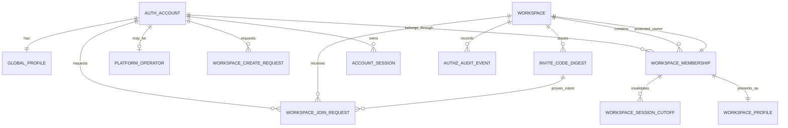
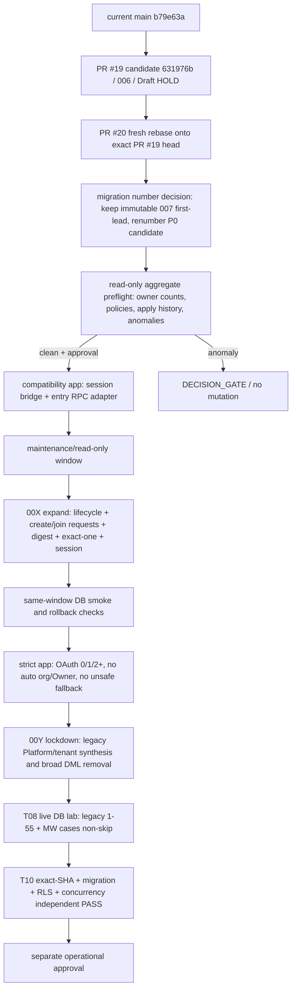

# Multi-Workspace AuthZ Contract

> WORK-ID: `MULTI-WORKSPACE-AUTHZ-CONTRACT-01`  
> 상위 WORK-ID: `MULTI-WORKSPACE-ENTRY-LAB-01`  
> 상태: **CONTRACT DRAFT / USER DECISION PENDING / DEV NOT ASSIGNED / DB·MERGE·DEPLOY HOLD**  
> 우선순위: tenant 격리 > protected Owner 보호 > 최소권한 기본값 > 위임 자유도 > 직관적 UX  
> 소비자: T05 통합, T08 DB lab, T10 독립검수  
> 이 문서는 구현·migration 적용·PR merge·운영 write를 승인하지 않는다.

## 1. 해결할 문제와 작은 조직 사용자 가치

MoaWork의 계정은 한 사람의 로그인 정체성이고, Workspace 소속은 그 계정이 특정 고객사에서 갖는 권한이다. 두 개념을 합치면 한 고객사의 Owner 또는 Platform 운영자 권한이 다른 고객사로 번지며, 복수 Workspace 사용자는 로그인할 때마다 임의의 고객사로 들어갈 수 있다.

이 계약은 대표·팀장·사원 세 명인 조직이 아래 흐름만 이해해도 시작하도록 만든다.

1. 대표 후보는 **새 회사 시작**을 명시적으로 선택하고 생성 요청을 낸다.
2. 생성 승인이 끝나면 한 transaction에서 Workspace, protected Owner, Workspace Profile, audit가 함께 생긴다.
3. 기존 회사에 들어갈 사람은 **회사 참여**를 선택하고 코드 또는 검색으로 참여 요청을 낸다.
4. 참여 승인은 언제나 `member/minimal`에서 시작한다. Admin 승격은 protected Owner가 별도 작업으로 수행한다.
5. 소속이 하나면 바로 업무로, 두 개 이상이면 Workspace 선택으로, 소속이 없으면 신규 Owner와 기존 joiner의 서로 다른 시작 화면으로 간다.

작은 조직의 기본 화면에는 Platform 등급, 복잡한 조직도, 고급 위임 모델을 노출하지 않는다. 성장한 조직은 같은 membership 경계 위에서 Admin과 세부 scope를 점진적으로 연다.

## 2. 읽기 증거 스냅샷

### 2.1 제품·보안 정본

- `docs/design/round-21/03-p0-authz-contract.md`: Workspace별 protected Owner 정확히 1명, Owner `scope=all`, Platform/Workspace plane 분리, invite/profile/session/RLS, direct org·membership DML 제거, 공격·경계 테스트 1~55를 계약한다.
- `docs/design/round-24/02-account-c-integration-gate.md`: `/account`는 `/settings/account`로 연결된 안전한 계정 shell만 운영 중이다. Workspace 전환·Profile write·모든 기기 로그아웃은 P0 근거 전 성공으로 표시할 수 없다.
- `docs/design/round-24/02-account-c-merge-order-amendment.md`: Account C 선행 배포와 PR #19 후행 rebase 순서를 정했고, PR #19의 `006` 운영 적용은 별도 HOLD다.

### 2.2 2026-07-25 원격 GitHub 실측

| 대상 | 관찰 상태 | 계약상 의미 |
|---|---|---|
| `main` | `b79e63a5a22c636538fe99b13e56c4b16295d58d` | 이 문서의 원격 기준점. 과거 SHA를 현재값으로 사용하지 않는다. |
| PR #19 | Draft/Open, base=`main@b79e63a`, head=`631976bde23632fc6cf4722951dec2832066da82`, mergeable=true, CI #94 success | `006_workspace_bootstrap.sql`과 callback/workspace service 후보. 실DB·merge·Production ready 증거는 아니다. |
| PR #20 | Draft/Open, base branch=`feat/workspace-bootstrap`, base SHA=`631976b`, head=`dc2cae7901696ef703b8e7b8a6219abb6efcdfd7`, mergeable=false | 현재 base와 head의 통합을 다시 검증해야 한다. 과거 CI #91 success는 새 base에 대한 exact-SHA PASS가 아니다. |

### 2.3 실제 코드·migration 관찰

| 관찰 파일 | 현재 동작 | 본 계약과의 차이 |
|---|---|---|
| `supabase/migrations/001_schema_v1.sql` | `users`, `orgs`, `org_members(role/scope)`와 광범위한 사용자 조회·membership 관리·audit insert 정책, org insert 후 Owner 생성 trigger | active 상태·session cutoff가 없고, 일반 관리 경로가 Owner row까지 닿을 수 있으며, direct DML 경계가 넓다. |
| `supabase/migrations/005_app_admins.sql` | 이메일 기반 Platform 판정이 Workspace `owner` 의미와 결합됨 | Platform operator와 tenant membership을 분리해야 한다. 이메일 기반 tenant role 합성은 lockdown 대상이다. |
| PR #19 `006_workspace_bootstrap.sql` | 이미 존재하는 Owner가 기본 pipeline/stage를 멱등 bootstrap | Workspace 생성 승인 또는 membership을 만들지 않는다. protected Owner가 먼저 안전하게 확정된 뒤에만 호출해야 한다. |
| PR #19 `auth/callback/route.ts` | 복수 membership 중 Owner를 우선 선택하고, Platform 판정 사용자가 소속이 없으면 org를 직접 생성 | 0/1/2+ 라우팅, 명시적 intent, Platform/tenant 분리에 충돌한다. 자동 선택·자동 생성은 strict cutover 전에 제거해야 한다. |
| PR #19 `auth/session.ts` | cookie가 가리킨 membership이 없으면 가장 오래된 membership 한 건으로 fallback하고 Platform role/scope를 Workspace context에 합성 | `last_workspace`가 권한 근거가 되며, 2+ 선택과 Platform 분리가 깨진다. active membership과 session cutoff를 매 요청 재검증해야 한다. |
| PR #20 `007_first_lead.sql` | membership row 존재만으로 첫 고객·첫 업무 RPC 허용 | active membership, 선택된 Workspace, non-revoked session 조건으로 후속 migration에서 강화해야 한다. |
| 로컬 P0 후보 `007_p0_authz_expand.sql` | Owner exact-one, digest invite, session registry, profile, 전용 RPC 후보가 있음 | PR #20의 migration 번호와 충돌한다. 생성은 승인 요청이 아니라 즉시 생성이며, join request·Workspace lifecycle·0/1/2+ routing·lookup rate limit이 없다. |
| 로컬 P0 session 후보 | session 등록/touch bridge와 callback/session 배선 후보가 있음 | 미병합 로컬 후보이며, 현재 원격 계약으로 간주하지 않는다. 신규 multi-workspace 상태와 함께 재검증해야 한다. |

## 3. 결정 층위

### 3.1 CONFIRMED

`CONFIRMED`는 이 작업 지시와 기존 P0 계약이 함께 확정한 불변 경계다.

1. `ACCOUNT_IDENTITY`: 로그인 정체성과 Global Profile은 계정 단위다.
2. `ACCOUNT_X_WORKSPACE_MEMBERSHIP`: 권한은 `(account_id, workspace_id)` membership 단위다. 한 계정은 0개 이상의 Workspace에 속할 수 있다.
3. `PROTECTED_OWNER_EXACT_ONE`: 존재하는 각 Workspace에는 commit 시점에 active Owner가 정확히 1명이고, Owner scope는 항상 `all`이다.
4. 일반 membership RPC와 direct DML은 Owner row를 수정·정지·삭제하지 못한다. Owner 변경은 재인증과 동시성 잠금을 가진 전용 transfer transaction만 사용한다.
5. `PLATFORM_TENANT_SEPARATION`: Platform operator 레코드는 tenant membership이 아니며, Workspace role/scope/Owner를 만들거나 덮어쓰지 않는다.
6. Workspace 생성 승인은 Workspace + requester의 unique Owner membership + Workspace Profile + request result + audit를 한 transaction에서 만든다. 하나라도 실패하면 전부 rollback한다.
7. Join 승인은 새 membership을 `member/minimal`로 만든다. Admin 승격은 Owner 전용 별도 transaction이다.
8. create/join/invite의 pending 상태는 membership이 아니다. pending 사용자에게 tenant SELECT/WRITE 권한을 주지 않는다.
9. invitation code의 원문은 저장하지 않는다. 서버가 계산한 digest만 저장한다.
10. Workspace cookie, URL slug, `last_workspace`는 선택 편의값이며 권한 증거가 아니다.
11. OAuth 이후 active membership 0/1/2+를 서버에서 세어 각각 다른 경로로 보낸다. 2+에서 첫 행이나 Owner 행을 자동 선택하지 않는다.
12. exact/generic lookup 모두 존재 여부·Owner·구성원 수·가입 여부를 불필요하게 노출하지 않고 rate limit을 적용한다.
13. terminal 요청의 재호출은 같은 idempotency key와 같은 payload일 때만 같은 결과를 돌려준다. 다른 payload 재사용은 충돌로 종료한다.
14. membership role/scope/status 변경, 제거, Owner transfer, Workspace suspend는 같은 transaction에서 session cutoff와 audit를 기록한다.
15. 신규 Owner B onboarding은 기존 Workspace joiner 흐름과 데이터·route·성공 조건을 공유하지 않는다.

### 3.2 RECOMMENDED DRAFT

`RECOMMENDED DRAFT`는 T05 제품 통합과 T08 DB lab에서 검증한 뒤 확정할 세부 설계다.

- 첫 release의 Workspace 생성 승인은 Platform operator의 명시적 승인으로 시작한다. 자동승인 정책을 쓰더라도 동일한 승인 RPC와 audit actor를 통과시킨다.
- 첫 release의 join 승인은 protected Owner만 수행한다. 향후 Owner가 명시적으로 위임한 Admin 승인 capability를 추가할 수 있지만 결과 role/scope는 계속 `member/minimal`이다.
- invite code는 기본 single-use, 짧은 만료, Owner 발급으로 시작한다. 다회용 코드는 사용량·폐기·재발급 정책을 검증한 후 연다.
- Workspace searchable 여부는 opt-in이다. 기본은 exact code 또는 정확한 slug 입력 외 discovery 불가다.
- membership `minimal`은 기존 enum과 호환되는 `member + assigned`로 투영하되, 새 capability layer에서 데이터가 배정되기 전 tenant business row 조회는 0건으로 제한한다.
- Workspace lifecycle은 `provisioning → active → suspended → pending_delete → deleted`를 사용한다. 생성 요청 자체는 Workspace row를 만들기 전 별도 상태로 유지한다.
- terminal create/join request는 불변 보존하고, 재신청은 새 request id로 만든다. 보존기간과 익명화 시점은 개인정보 정책에서 정한다.
- rate-limit 수치, cooldown, retention은 운영 측정 후 결정하되 DB unique/lock을 대체하지 않는다.

### 3.3 DECISION_GATE

아래가 닫히기 전에는 writer lease, migration 번호, 구현 PR을 열지 않는다.

| Gate | 필요한 결정 | 권장 기본값 | 증거 소유자 |
|---|---|---|---|
| DG-01 승인자 | Workspace 생성 승인 주체와 join 승인 위임 범위 | 생성=Platform operator, join=Owner only | 사용자/MWC + T05 |
| DG-02 discovery | Workspace 검색 공개 범위와 exact/generic 응답 envelope | 비공개 기본, generic 응답 동일화 | 사용자 + T05/T10 |
| DG-03 invite | single/multi-use, 만료, 회수, 재발급 | single-use, 제한된 만료 | 사용자 + T08 |
| DG-04 rate limit | 계정·네트워크·digest별 임계치와 cooldown | 보수적 서버 기본값, 수치는 운영설정 | OPS/T10 |
| DG-05 lifecycle | suspend/delete 승인자, 보존기간, Owner 이전 선행 | Owner 이전 없이는 delete 금지 | 사용자/법무/MWC |
| DG-06 numbering | PR #20의 `007`과 P0 후보 `007` 충돌 해소, 실제 적용 이력 | 기존 migration 불변, 새 번호 재배정 | 단일 DB writer + T10 |
| DG-07 cutover | compatibility app, maintenance/read-only, strict app, lockdown 순서와 stop/forward-fix | 직렬 적용 | MWC/OPS + T10 |
| DG-08 live lab | 합성 fixture, 실DB/RLS/동시성 non-skip 실행 권한 | T08 lab 후 T10 독립검수 | T08/T10 |

## 4. ER 개념 모델과 소유권 경계



| Entity | 최소 데이터 | writer/reader 경계 |
|---|---|---|
| `AUTH_ACCOUNT` | provider 검증 id, 인증 상태 | Auth provider만 검증정보 write. tenant role 없음 |
| `GLOBAL_PROFILE` | 공통 표시명·avatar | self 기본. OAuth callback은 최초 seed만 허용 |
| `WORKSPACE` | id, name, slug, lifecycle, created/updated | 승인·lifecycle 전용 RPC만 write |
| `WORKSPACE_MEMBERSHIP` | workspace/account, role, scope, status, version | 승인·전용 membership RPC만 write. 복합키가 권한 단위 |
| `WORKSPACE_PROFILE` | workspace/account, 표시명·직책·팀 | membership과 1:1. role/scope를 포함하지 않음 |
| `PLATFORM_OPERATOR` | account id, platform capability, status | Platform plane 전용. tenant policy 조건으로 사용 금지 |
| `WORKSPACE_CREATE_REQUEST` | requester, desired workspace attributes, state, request id, decision, result workspace | requester submit/cancel, Platform 승인 전용 RPC |
| `WORKSPACE_JOIN_REQUEST` | workspace, requester, source, state, request id, version, decision | requester submit/cancel, 승인자 decide RPC |
| `INVITE_CODE_DIGEST` | workspace, digest, issuer, expiry, usage/terminal state | Owner 발급·회수, 서버 consume. raw code 저장 금지 |
| `ACCOUNT_WORKSPACE_PREFERENCE` | account, last workspace id, updated | self 편의값. membership/RLS 조건 금지 |
| `ACCOUNT_SESSION` | digest, account, created/seen/expires/revoked | 인증 bridge/RPC만 write. raw session id 저장 금지 |
| `WORKSPACE_SESSION_CUTOFF` | workspace/account, cutoff, reason | authz mutation transaction만 write |
| `AUTHZ_AUDIT_EVENT` | workspace nullable, actor plane/id, action, target, request id, non-PII meta | 업무 RPC만 insert. client direct insert 금지 |

## 5. 데이터 불변조건

### 5.1 Identity와 membership

- 계정 삭제·정지는 모든 membership을 자동 Owner 변경 없이 삭제하지 않는다. Owner가 있는 계정은 먼저 Owner transfer 또는 Workspace 종료 결정이 필요하다.
- 동일 계정의 여러 membership은 서로 독립이다. Workspace A의 role/scope/status 변화가 Workspace B에 영향을 주지 않는다.
- membership의 `workspace_id`와 `account_id`는 생성 후 변경하지 않는다. Workspace 이동은 기존 membership 종료 + 새 Workspace join/approval로 표현한다.
- Workspace Profile은 membership 없이는 존재할 수 없다. membership 종료 시 profile은 정책에 따라 비활성/익명화하되 다른 Workspace Profile과 섞지 않는다.

### 5.2 Protected Owner

- 각 존재 Workspace는 commit 시 active Owner가 정확히 1명이다.
- Owner의 role, scope, active status는 일반 update/delete 대상이 아니다.
- Admin은 Owner를 조회할 수 있어도 변경·정지·삭제·교체하지 못한다.
- Owner transfer는 Workspace row와 현재/대상 membership을 잠그고, 대상 active non-owner 검증, fresh reauth, 기존 Owner 강등, 대상 Owner 승격, 양측 session cutoff, audit를 한 transaction에서 처리한다.
- Workspace suspend/pending_delete에서도 protected Owner row를 보존한다.

### 5.3 Platform/tenant 분리

- Platform operator는 Workspace 목록 운영 조회를 위한 별도 projection만 사용한다. tenant business table RLS는 active membership 없이는 항상 거부한다.
- Platform 승인자가 Workspace를 생성해도 requester만 Owner가 된다. 승인자에게 membership을 자동 생성하지 않는다.
- Platform capability가 Workspace role/scope를 덮어쓰는 session context는 허용하지 않는다.
- tenant UI에는 Platform 등급이나 persona selector를 표시하지 않는다.

### 5.4 Pending request와 code

- create/join pending row와 invite digest는 tenant membership이 아니다.
- terminal 상태는 되돌리지 않는다. reapply는 새 row와 새 idempotency key를 사용한다.
- invite 원문·세션 원문·인증 secret은 DB, audit, log, 이 문서에 남기지 않는다.
- digest 비교 전후 오류 응답은 존재/만료/회수/사용 여부를 외부에서 구분하지 못하게 한다.

## 6. 상태 전이

### 6.1 Workspace create request

```text
draft -> submitted -> approved
                  \-> rejected
                  \-> cancelled
                  \-> expired
```

- `draft`: 서버 권한을 만들지 않는 입력 상태.
- `submitted`: 승인 대기. 같은 requester의 같은 request id 재호출은 동일 payload일 때만 재사용.
- `approved`: 승인 transaction 결과 Workspace id가 고정된다.
- `rejected/cancelled/expired`: terminal. 재승인하거나 복구하지 않는다.
- 승인과 cancel이 경합하면 row lock과 expected version으로 먼저 commit한 terminal 상태만 인정한다.

### 6.2 Workspace lifecycle

```text
provisioning -> active -> suspended -> active
                         -> pending_delete -> deleted
```

- Workspace row는 create approval transaction 안에서 `provisioning`으로 생성되고 protected Owner·Profile·audit가 모두 성공한 후 commit된다.
- `active` 전에는 tenant business write와 PR #19 bootstrap을 열지 않는다.
- `suspended`는 모든 tenant session을 cutoff하고 write를 차단한다. protected Owner는 유지한다.
- `pending_delete`는 새 join/create/invite와 업무 write를 차단한다.
- `deleted`는 논리적 terminal 상태다. 물리 삭제·보존기간은 DG-05 전 미확정이다.

### 6.3 Join request

```text
draft -> submitted -> approved
                  \-> rejected
                  \-> cancelled
                  \-> expired
```

- `submitted`까지 membership은 0건이다.
- `approved` transaction은 기존 active membership 부재를 재검증하고 `member/minimal` membership, Workspace Profile, result, audit를 함께 만든다.
- 동일 Workspace/account의 active pending request는 하나만 허용한다.
- reject/cancel 뒤 재신청은 새 row로 만들고 cooldown/rate limit을 적용한다.

### 6.4 Membership

```text
active(member/minimal) -> active(member/expanded)
                       -> active(admin/*)  [Owner-only promotion]
                       -> suspended -> active
                       -> removed
```

- `removed`는 권한 terminal이다. rejoin 승인 시 새 lifecycle instance 또는 명시적 revive transaction 중 하나를 DG-05에서 선택한다.
- Owner는 이 상태기계로 들어오지 않는다. Owner 변경은 transfer 전용 상태전이다.
- role/scope/status가 변하면 membership version과 Workspace session cutoff를 같은 transaction에서 갱신한다.

## 7. RPC 계약

아래 이름은 `RECOMMENDED DRAFT`다. migration 번호와 실제 함수명은 writer gate에서 동결한다.

### 7.1 `submit_workspace_create_request`

- 입력: request id, 이름·slug 후보의 검증된 필드만.
- precondition: 유효한 account session. Platform 상태나 기존 Owner 여부로 자동 승인하지 않는다.
- 결과: opaque request id와 generic 상태. Workspace id는 승인 전 반환하지 않는다.
- 동일 key/same payload는 동일 결과, 동일 key/different payload는 conflict.

### 7.2 `cancel_workspace_create_request`

- requester의 `submitted` row만 취소한다.
- 승인 transaction이 row lock을 먼저 얻었으면 cancel은 승인 결과를 되돌리지 않는다.
- cancel은 기존 Workspace나 membership을 삭제하지 않는다.

### 7.3 `approve_workspace_create_request`

- actor는 active Platform operator이며 tenant membership으로 평가하지 않는다.
- request row와 name/slug reservation을 잠근다.
- 한 transaction에서 Workspace `provisioning`, requester Owner/all/active membership, Workspace Profile, approved result, audit를 만든다.
- commit-time exact-one 검사를 통과한 뒤에만 성공한다.
- profile 또는 audit 실패를 포함한 어떤 오류도 부분 Workspace를 남기지 않는다.
- 승인자는 생성된 Workspace membership을 받지 않는다.

### 7.4 `reject_workspace_create_request`

- submitted row만 terminal reject로 바꾼다.
- 사유는 제한된 reason code만 audit에 저장하며 사용자 원문·민감정보를 남기지 않는다.

### 7.5 `submit_workspace_join_request`

- 입력: exact code capability 또는 허용된 discovery workspace handle 중 하나, request id.
- 서버는 target을 해석하지만 외부 응답은 존재 여부를 구분하지 않는 envelope을 사용한다.
- 기존 active membership이면 새 권한을 만들지 않고 이미 소속됨을 자기 자신에게만 안전하게 반환한다.
- pending 중복은 idempotent, terminal row 재사용은 금지한다.

### 7.6 `cancel_workspace_join_request` / `reject_workspace_join_request`

- cancel은 requester, reject는 승인 capability 보유자만 수행한다.
- terminal race는 expected version + row lock으로 한 결과만 commit한다.
- membership이 이미 생성된 뒤에는 request cancel/reject로 membership을 삭제하지 않는다.

### 7.7 `approve_workspace_join_request`

- actor, target Workspace, request, requester account session을 재검증한다.
- 첫 release 권장은 protected Owner only다.
- 결과 membership은 무조건 `member/minimal/active`다. 요청 payload나 code가 Admin/Owner를 지정할 수 없다.
- membership + Workspace Profile + approved result + audit를 한 transaction으로 처리한다.
- 중복 승인 재호출은 동일 결과만 반환한다.

### 7.8 `issue_workspace_invite_code` / `revoke_workspace_invite_code`

- raw code는 응답에서 한 번만 전달하고 저장하지 않는다. DB에는 keyed digest와 정책 metadata만 둔다.
- code는 Owner가 발급·회수한다. Admin 위임은 DG-03 후 별도 capability로 연다.
- code 사용은 join intent를 증명할 뿐 기본적으로 membership을 직접 만들지 않는다.
- 회수·만료·사용완료는 terminal이며 generic lookup 응답은 같은 외형을 유지한다.

### 7.9 `promote_member_to_admin`

- protected Owner만 호출한다.
- active member만 대상이며 self·Owner·다른 Workspace 대상은 거부한다.
- role/scope update, version 증가, target session cutoff, audit를 원자 처리한다.
- Admin은 이 RPC 또는 동일 의미의 generic membership RPC를 호출할 수 없다.

## 8. OAuth active membership 0/1/2+ routing

`OAUTH_0_1_2_ROUTING`은 callback이 Auth exchange와 account session 등록을 끝낸 뒤 **active membership만** 다시 읽어 결정한다.

| active membership 수 | 서버 결정 | route/UX | 금지 |
|---:|---|---|---|
| 0 | pending create/join 상태와 명시적 entry intent를 account plane에서 조회 | pending이면 상태 화면. intent가 `new-owner`면 B onboarding, `join-existing`이면 join 화면, 없으면 두 선택지를 제시 | Platform status만으로 org 생성, Owner 자동부여, 임의 Workspace cookie 설정 |
| 1 | 단 하나의 active membership을 선택하고 상태·session cutoff 재검증 | 해당 Workspace로 이동. Owner라면 active Workspace에서만 006 bootstrap을 멱등 호출 | suspended/removed membership 선택, cookie만 신뢰 |
| 2+ | 유효한 `last_workspace`가 active membership이면 편의상 preselect, 아니면 picker | Workspace picker에서 사용자가 선택. 선택 후 서버가 membership을 다시 검증하고 preference 갱신 | 첫 row/가장 오래된 row/Owner row 자동 선택 |

- callback의 OAuth profile write는 최초 seed만 허용한다. 이후 로그인에서 Global/Workspace Profile 편집값을 덮어쓰지 않는다.
- 안전한 `next`는 선택된 Workspace의 권한과 맞을 때만 적용한다. 다른 Workspace slug를 가리키면 picker 또는 denied로 수렴한다.
- `last_workspace`가 삭제·정지·membership 제거된 Workspace면 폐기하고 권한 오류가 아니라 선택 흐름으로 돌아간다.
- Platform console session과 Workspace session context는 별도 loader/route를 사용한다.

## 9. Lookup·enumeration·rate-limit 계약

`ENUMERATION_GUARD`는 UI 문구가 아니라 서버·DB 동작이다.

### Exact lookup

- 사용자가 전체 invite code를 제출하면 서버가 keyed digest를 계산하고 exact match한다.
- raw code, digest, 내부 Workspace id, terminal 원인은 client log·analytics·audit meta에 남기지 않는다.
- invalid, expired, revoked, used, non-discoverable은 동일한 generic 실패 envelope과 유사한 처리 경로를 사용한다.
- code 확인 성공도 membership 또는 Owner 정보를 반환하지 않고 join request를 만들 수 있는 최소 capability만 준다.

### Generic lookup

- 검색이 허용된 Workspace만 최소 표시명과 안전한 구분자만 반환한다.
- Owner 이름, login identity, 구성원 수, 가입/대기 여부, 정확한 lifecycle 내부 상태를 반환하지 않는다.
- 결과 없음과 비공개 Workspace는 외부에서 구분하지 않는다.
- exact name/slug hit라도 서버가 공개 여부를 먼저 확인한다.

### Rate limit

- account, network bucket, operation, target/digest bucket을 함께 사용한다.
- 제한 상태도 대상 존재 여부와 무관한 동일 응답을 사용한다.
- DB unique index·row lock·idempotency는 rate limit과 별개로 반드시 유지한다.
- 구체 임계치·window·cooldown은 DG-04다. client-only throttle은 보안 통제가 아니다.

## 10. 실패·경합·복구 계약

| 상황 | 기대 결과 |
|---|---|
| create approve 두 번 | 첫 commit 결과 재사용. Workspace/Owner/Profile/audit 중복 0 |
| create approve 대 cancel | row lock을 먼저 commit한 terminal 상태만 유효. 부분 생성 0 |
| slug/name 충돌 | 다른 Workspace 존재를 과도하게 노출하지 않는 conflict. 새 Owner/membership 0 |
| join approve 두 번 | membership 한 건, profile 한 건, audit 의미 한 건, 동일 result |
| join approve 대 reject/cancel | 한 terminal만 성공. 승인 실패 시 membership 0 |
| invite revoke 대 submit | 잠금 뒤 한 상태만 성공. 회수된 capability로 membership 0 |
| 두 Owner 후보 동시 승격 | exact-one 제약과 Workspace lock으로 하나만 commit |
| Admin이 Owner 수정 시도 | 전용/non-owner RPC, direct DML, 우회 policy 모두 거부 |
| audit insert 실패 | create/join/promotion/transfer 전체 rollback |
| membership 제거 직후 old token | Workspace cutoff 때문에 protected request 거부 |
| Workspace suspend 직후 old token | Workspace 전체 cutoff와 lifecycle 검사로 거부 |
| last_workspace stale | 권한 부여 없이 picker 또는 0/1 route로 복구 |
| Platform operator tenant 접근 | 명시적 active membership 없으면 tenant row 0/write 거부 |
| 재신청 | terminal row 부활 금지, 새 request id와 rate/cooldown 적용 |

Rollback은 보안 제약을 약화하는 down migration을 뜻하지 않는다. 장애 시 create/join/invite/member mutation을 maintenance/read-only로 닫고, 이미 적용한 exact-one·tenant RLS·direct DML 차단은 유지한 채 forward-fix한다.

## 11. 현재 코드 충돌과 PR #19/#20 영향

### PR19_IMPACT

1. `auth/callback/route.ts`의 Owner 우선 선택과 Platform 기반 org 자동 생성은 이 계약과 직접 충돌한다.
2. `auth/session.ts`의 임의 membership fallback 및 Platform role/scope 합성은 제거 대상이다.
3. `006_workspace_bootstrap.sql` 자체는 Owner-only 멱등 bootstrap으로 재사용 가능하다. 다만 create approval transaction과 active Workspace 선택이 끝난 후에만 호출한다.
4. `workspace/service.ts`의 compatibility fallback은 정확한 미정의 함수 오류 외에는 fail closed해야 하며, strict cutover 뒤 direct org insert fallback은 0이어야 한다.
5. PR #19는 현재 Draft/HOLD다. 이 계약은 그 branch를 자동 rebase·merge하거나 `006`을 적용할 권한이 아니다.

### PR20_IMPACT

1. 현재 PR #20은 새 PR #19 base에 대해 mergeable=false다. fresh rebase와 동일 base/head exact-SHA 검증 전 REMOTE GREEN·MERGE READY로 표시하지 않는다.
2. `007_first_lead.sql`은 active membership + selected Workspace + non-revoked session으로 강화해야 한다.
3. 첫 고객/첫 업무 UI는 0 membership의 신규 Owner/joiner에게 성공 route를 보여주지 않는다. Workspace create approval과 provisioning/active 전환 이후에만 연다.
4. PR #20 `007`과 로컬 P0 `007`은 번호가 충돌한다. 둘 중 하나를 덮어쓰거나 과거 migration을 rename한 채 이미 적용됐다고 가정하지 않는다.
5. PR #20의 과거 CI 성공은 current base 통합과 새 AuthZ 계약의 live DB PASS가 아니다.

### 병렬 P0 후보 영향

- `007_p0_authz_expand.sql`의 protected Owner, session digest/cutoff, Workspace Profile, digest invite, 전용 RPC 구현은 재사용 후보다.
- 즉시 Workspace 생성 RPC는 승인형 create request로 분리해야 한다.
- 현재 email-target invite는 새 invite-code/join-request 모델과 공존 여부를 DG-03에서 결정한다. 어느 쪽도 pending을 membership으로 만들 수 없다.
- current candidate의 생성 request table은 이미 생성된 Workspace receipt에 가깝다. 제출/승인/거절/취소 상태기계로 대체 또는 확장해야 한다.
- 병렬 후보는 local-only이며 원격 main/PR contract로 승격하지 않는다.

## 12. 화면·파일·데이터·상태 계약

### 화면 계약

| 사용자 상태 | 화면이 보여야 할 것 | 성공으로 보이면 안 되는 것 |
|---|---|---|
| 신규 Owner B | 새 회사 시작, 요청 상태, 승인 후 준비 상태 | 승인 전 Workspace dashboard, Owner badge |
| 기존 joiner | 회사 참여, code/search, 요청 상태 | 승인 전 구성원 목록·업무 데이터 |
| active membership 1 | 현재 Workspace, 명확한 전환 진입 | cookie만으로 성공 |
| active membership 2+ | Workspace picker, last 사용 표시 | 임의 자동 선택 |
| pending/rejected/cancelled | generic 상태와 다음 허용 행동 | 대상 존재·Owner·내부 거절사유 노출 |
| suspended/removed | denied/복구 안내 | stale session으로 업무 계속 |

Account C의 `/account → /settings/account` read-only shell은 유지한다. Workspace picker/Profile edit/모든 기기 로그아웃 성공 UI는 각 서버·DB·RLS 계약과 live evidence가 생길 때까지 progressive disclosure 뒤에 둔다.

### 파일 계약

다음 경로는 구현 후보이며 이름은 writer gate에서 확정한다.

| 단계 | 신규/수정 후보 파일 | 책임 |
|---|---|---|
| schema expand | `supabase/migrations/00X_multi_workspace_entry_expand.sql` | request/lifecycle/preference/digest 구조, additive constraints, RLS default deny |
| RPC + invariant | 같은 expand migration 또는 분리된 `00X_multi_workspace_entry_rpc.sql` | submit/cancel/approve/reject, exact-one, idempotency, audit rollback |
| lockdown | `supabase/migrations/00Y_multi_workspace_entry_lockdown.sql` | legacy Platform/Owner 합성, broad direct DML/policy, unsafe fallback 제거 |
| callback | `app/src/app/auth/callback/route.ts` + test | account session 등록, 0/1/2+ routing, profile seed-only |
| session | `app/src/lib/auth/session.ts`, `app/src/lib/auth/session-bridge.ts` + tests | selected active membership + cutoff, no Platform synthesis |
| context | `app/src/lib/workspace/context.ts` + test | last_workspace convenience, picker validation |
| request service | `app/src/lib/workspace/entry-service.ts` + test | RPC adapter, generic errors, idempotency |
| server routes | `app/src/app/(app)/onboarding/**`, `app/src/app/(app)/workspace-select/**` | Owner B/joiner/picker 분리 |
| proxy | `app/src/proxy.ts` + test | public/auth/account/workspace plane route guard |
| first value | PR #19 workspace service, PR #20 CRM service/tests | active Workspace 이후 bootstrap·first lead |
| static contract | `scripts/test-multi-workspace-authz.mjs` | migration marker·forbidden legacy path 검사 |
| live DB | `supabase/tests/multi_workspace_authz.sql` 또는 T08 지정 harness | RLS·race·rollback·session non-skip |

### 데이터 계약

- Auth Identity, Global Profile, Workspace Profile, Membership Authorization, Platform Operator를 서로 다른 writer 경계로 유지한다.
- role/scope/status는 membership에만 둔다. 표시 직책·팀은 Workspace Profile에 둔다.
- audit metadata에는 raw code, raw session, login identity 원문, 요청 자유서술을 넣지 않는다.
- `last_workspace`는 account preference일 뿐 session/RLS grant가 아니다.

## 13. 구현·migration DAG

`MIGRATION_DAG`는 순서를 설명하며 적용 승인이 아니다. 실제 번호는 DG-06 전 `00X/00Y`로 유지한다.



### Node entry/exit/STOP

| Node | Entry | Exit evidence | STOP |
|---|---|---|---|
| N0 current state | connector + repo read-only | exact main/PR base/head/apply-state receipt | remote drift 또는 apply-state unknown |
| N1 PR #19/006 | current main rebase, Account C preserved | exact SHA checks + `006` unchanged/validated | callback conflict unresolved, live DB gate absent |
| N2 PR #20/007 | exact new PR #19 head | mergeable + fresh CI/build/tests on exact base/head | mergeable=false, stale CI, migration conflict |
| N3 numbering | actual migration table/apply history | immutable ordered filenames, sole DB writer lease | duplicate number, rename of applied migration |
| N4 preflight | read-only SQL approved | zero/explicitly adjudicated owner/policy/session anomalies | exact-one anomaly, legacy synthesis unknown |
| N5 compatibility app | N3/N4 ready, no DB mutation | old/new DB compatibility tests; only exact missing-function bridge | broad error fallback, direct org insert continues after expand |
| N6 expand | maintenance/read-only + rollback/forward-fix runbook | transaction applied, request/invariant/RLS smoke PASS | partial apply, owner anomaly, audit rollback failure |
| N7 strict app | expand smoke PASS | 0/1/2+ route, active membership/session tests PASS | auto Workspace/Owner or Platform synthesis remains |
| N8 lockdown | strict app deployed/read-back | unsafe policy/DML/fallback absent | app still depends on legacy path |
| N9 T08/T10 | synthetic fixtures, live DB, exact SHA | legacy 1~55 + MW suite non-skip PASS | any skip, tenant leak, race, stale token success |
| N10 ops | all prior evidence + user/MWC approval | explicit apply/merge/deploy receipt | green CI alone, Preview alone, contract-only PASS |

## 14. 테스트·수용조건

### 14.1 기존 P0 공격검사 연결

T08은 `03-p0-authz-contract.md`의 1~55를 폐기하거나 축약하지 않는다.

- 1~10: Owner/Admin 보호
- 11~15: Platform/Workspace 분리
- 16~21: invite 경계
- 22~27: profile/tenant 격리
- 28~34: session revoke/cutoff
- 35~43: RLS/audit
- 44~55: exact-one, create rollback, compatibility/lockdown

### 14.2 신규 multi-workspace DB lab

| ID | 테스트 | PASS 조건 |
|---|---|---|
| MW-01 | account 0 membership OAuth | tenant row 0, 신규 Owner/join 선택만 가능 |
| MW-02 | account 1 active membership OAuth | 그 Workspace만 선택, server 재검증 |
| MW-03 | account 2+ membership OAuth | picker, 자동 첫/Owner 선택 0 |
| MW-04 | stale last_workspace | 권한 부여 0, 안전한 picker 복귀 |
| MW-05 | Platform-only OAuth | tenant membership/Owner/org 자동생성 0 |
| MW-06 | create approve success | Workspace 1, Owner 1, scope all, profile 1, audit 1 |
| MW-07 | create profile failure | Workspace/Owner/profile/audit 모두 0 |
| MW-08 | create audit failure | Workspace/Owner/profile/audit 모두 0 |
| MW-09 | create approve race | 결과 Workspace 하나, Owner 하나 |
| MW-10 | approve/cancel race | terminal 하나, partial row 0 |
| MW-11 | pending create tenant access | SELECT 0/write 거부 |
| MW-12 | join approve default | member/minimal만 생성 |
| MW-13 | join payload Admin/Owner 주입 | 거부, membership 0 |
| MW-14 | join approve/reject/cancel race | terminal 하나, 중복 membership 0 |
| MW-15 | duplicate reapply | terminal 부활 0, 새 request만 허용 |
| MW-16 | invite storage scan | raw code 0, digest만 존재 |
| MW-17 | invalid/expired/revoked/used code | 동일 generic envelope, tenant metadata 0 |
| MW-18 | exact lookup rate limit | 제한 후 대상 존재 여부 비노출 |
| MW-19 | generic lookup enumeration | Owner·구성원·가입상태·내부 lifecycle 0 |
| MW-20 | Owner direct update/delete | 모든 경로 거부 |
| MW-21 | Admin promotes Admin | 거부 |
| MW-22 | Owner promotes member | role/scope + version + cutoff + audit 원자 성공 |
| MW-23 | membership removal old session | protected request 즉시 거부 |
| MW-24 | Workspace suspend old session | 모든 tenant write 거부, Owner row 유지 |
| MW-25 | cross-workspace request id replay | 다른 Workspace 권한/결과 획득 0 |
| MW-26 | PR #20 first lead with pending membership | 거부 |
| MW-27 | PR #20 first lead with active selected membership | 해당 Workspace 안에서만 성공 |
| MW-28 | OAuth relogin after profile edit | Global/Workspace Profile 덮어쓰기 0 |

### 14.3 파일·코드 테스트

- `auth/callback/route.test.ts`: 0/1/2+, stale preference, pending request, Platform-only, safe next, profile seed-only.
- `auth/session.test.ts`: selected active membership, suspended/removed, cross-Workspace cookie, cutoff, Platform context 분리.
- `workspace/entry-service.test.ts`: generic error mapping, idempotency, exact missing-function bridge만 허용.
- `proxy.test.ts`: account plane, Workspace picker, tenant route, Platform console 간 bypass 0.
- PR #19 workspace tests: approval 전 bootstrap 0, active Owner Workspace에서만 006 호출.
- PR #20 CRM tests: pending/foreign/stale session 거부, active selected Workspace만 허용.
- static migration test: 적용된 migration 불변, 중복 번호 0, Owner 일반 mutation 경로 0, direct org/membership writer 0.

### 14.4 문서 수용 marker

다음 marker가 모두 있어야 한다.

- `MULTI-WORKSPACE-AUTHZ-CONTRACT-01`
- `ACCOUNT_IDENTITY`
- `ACCOUNT_X_WORKSPACE_MEMBERSHIP`
- `PROTECTED_OWNER_EXACT_ONE`
- `PLATFORM_TENANT_SEPARATION`
- `OAUTH_0_1_2_ROUTING`
- `INVITE_CODE_DIGEST_ONLY`
- `ENUMERATION_GUARD`
- `MIGRATION_DAG`
- `PR19_IMPACT`
- `PR20_IMPACT`
- `T08_DB_LAB`
- `T10_INDEPENDENT_REVIEW`
- `NEXT_WORK: MULTI-WORKSPACE-DB-LAB-01`

문서와 후속 증거에는 실제 개인정보, raw code/session, secret assignment, 운영 credential이 없어야 한다. 위험한 broad permission이나 Platform-to-Owner 자동승격 코드를 예시로 재수록하지 않는다.

## 15. STOP·ROLLBACK·release 경계

다음 중 하나면 즉시 STOP/HOLD다.

- 현재 main, PR #19/#20 base/head, 실제 migration apply state 중 하나라도 unknown
- PR #20 mergeable=false 또는 fresh exact-base CI/T10 부재
- migration 번호 충돌 또는 적용 migration rename 계획
- Owner 0명/2명 이상, Owner scope/status anomaly 미판정
- direct membership/org DML 또는 broad user/audit path 잔존
- Platform capability가 tenant role/scope/Owner를 합성
- callback이 2+에서 임의 membership 선택 또는 0에서 자동 org 생성
- create/join/audit/profile 중 부분 commit 가능
- invite/session raw secret 저장·로그 가능
- exact/generic lookup enumeration 또는 server rate limit 부재
- live DB 공격검사 skip

Migration 적용 후 보안 제약을 되돌려 장애를 숨기지 않는다. 신규 entry/membership write를 maintenance로 닫고 forward-fix한다. CI/Preview green, contract PASS, mergeable=true는 각각 코드 후보 증거일 뿐 DB·Production·운영 write 승인이 아니다.

## 16. 소비자와 상태

### T05 통합

- 신규 Owner B와 기존 joiner를 서로 다른 entry route/state로 설계한다.
- 작은 조직 기본은 Owner 승인 + member/minimal이며 Admin·검색·다회용 code는 progressive disclosure로 둔다.
- DG-01~05 사용자 결정을 수집하고 화면 문구가 존재 여부를 누설하지 않는지 검수한다.

### T08_DB_LAB

- 기존 공격테스트 1~55와 MW-01~28을 실제 Postgres/RLS fixture에서 non-skip 실행한다.
- create/join terminal race, exact-one deferred constraint, audit failure rollback, stale session cutoff, rate limit을 동시성으로 검증한다.
- synthetic account/workspace만 사용하고 실제 고객 데이터·login identity·secret을 fixture에 넣지 않는다.

### T10_INDEPENDENT_REVIEW

- exact main/base/head, migration numbering/apply history, diff, migration SQL, app callback/session/proxy, live DB 결과를 독립 재측정한다.
- PR #19/20의 과거 green을 새 base 또는 새 migration PASS로 승계하지 않는다.
- contract-only PASS와 implementation/DB/release PASS를 구분한다.

| 주체 | 현재 상태 | 다음 조건 |
|---|---|---|
| 사용자 결정 | `PENDING` | DG-01~05 확정 |
| DEV writer | `NOT ASSIGNED / HOLD` | DG-06~08, sole worktree/file lease, exact base 동결 |
| T08 | `LAB PENDING` | 합성 실DB fixture와 실행 권한 |
| T10 | `CONTRACT REVIEW PENDING` | artifact 검수 후 구현 exact-SHA/live DB 재검수 |
| PR #19 | `DRAFT / 006 HOLD` | 현재 base 검증, P0 DAG와 별도 운영 승인 |
| PR #20 | `DRAFT / MERGEABLE FALSE / HOLD` | fresh rebase + exact-base checks |
| DB/Production | `NO WRITE AUTHORIZED` | 전체 DAG PASS + 별도 운영 승인 |

## 17. 즉시 다음 작업

`NEXT_WORK: MULTI-WORKSPACE-DB-LAB-01`

T08은 실제 migration 번호를 임의 확정하지 않고, 이 계약의 논리 schema/RPC를 임시 격리 DB에 구현해 MW-01~28과 기존 1~55의 교집합을 검증한다. 결과는 T05 제품 통합과 T10 writer gate의 입력이며, 운영 DB 적용이나 PR merge 권한이 아니다.

## 18. Blindspot Pass

- 전체: 사용자는 계정으로 로그인하지만 권한은 매 Workspace membership에서만 얻는다.
- 부분: protected Owner, 생성/참여 요청, invite digest, 0/1/2+ 선택, enumeration, session cutoff, PR/migration 충돌을 각각 닫는다.
- 전체 재검증: 신규 Owner B의 빠른 시작을 이유로 승인 transaction을 우회하거나, 기존 joiner의 편의를 이유로 pending을 membership으로 바꾸거나, Platform 운영 편의를 이유로 tenant Owner를 합성하면 전체 계약이 무너진다. 작은 조직 UX는 단순해야 하지만 권한 근거까지 단순 추정해서는 안 된다.
