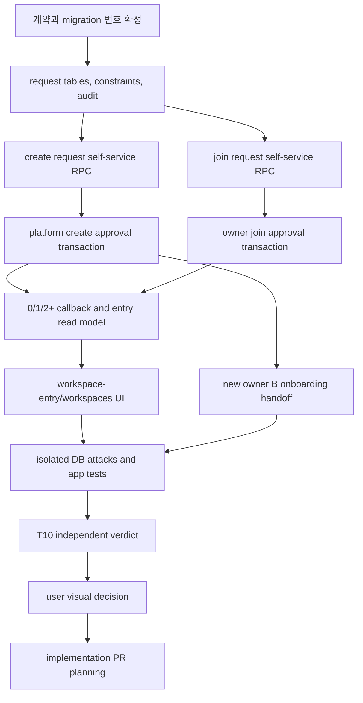

# MULTI-WORKSPACE-ENTRY-LAB-01 통합 제품 계약

- 상태: `PASS_EXACT_CURRENT_HASH / USER_VISUAL_SELECTION_PENDING / HOLD_PRODUCT_MERGE`
- 작업반장: T05
- 사용자 시각 승인 전 금지: 제품 코드 변경, 기존 제품 Git/PR 변경, Production DB 변경, merge, deploy
- 허용 범위: 설계 문서, 단일 HTML prototype, 격리 DB lab과 검증

## 1. 전체 — 제품 원칙과 고정 결정

우선순위는 `tenant 격리 > owner 보호 > 최소권한 기본값 > 위임 자유도 > 직관적 UX`다. 계정 인증, 플랫폼 운영 권한, tenant membership을 서로 다른 사실로 취급한다.

1. 모든 Google 계정은 로그인할 수 있다. 인증 성공은 tenant 접근권한을 뜻하지 않는다.
2. 활성 membership이 0개이면 `/workspace-entry`로 보낸다. `permission denied`로 되돌리지 않는다.
3. 활성 membership이 1개이면 유일한 workspace로 진입한다. 상단 switcher는 계속 제공한다.
4. 활성 membership이 2개 이상이면 `/workspaces`에서 선택한다. `last_workspace`는 편의값일 뿐 권한 근거가 아니다.
5. workspace 생성은 신청자가 직접 하지 않는다. 플랫폼 관리자가 신청을 승인하는 transaction만 workspace와 유일 owner를 만든다.
6. 기존 workspace 합류 신청은 그 workspace의 보호된 owner가 승인 또는 거절한다. 승인 기본값은 `member + minimal scope`다.
7. workspace마다 활성 protected owner는 정확히 1명이다. 일반 RPC와 direct DML로 owner 변경·삭제·추가를 허용하지 않는다.
8. 한 계정은 여러 workspace의 member 또는 owner일 수 있다. 역할은 account가 아닌 account×workspace membership에 붙는다.
9. 플랫폼 운영자는 명시적 membership 없이는 tenant 데이터를 볼 수 없다. 플랫폼 역할은 tenant membership을 암시하지 않는다.
10. 신규 owner 온보딩은 `회사 이름 확인/수정 → 팀원 초대 → CSV 가져오기`다. joiner는 이 흐름을 거치지 않는다.

## 2. 부분 — 라우팅 계약

| 입력 상태 | 결정적 목적지 | 권한 효과 |
|---|---|---|
| unauthenticated | `/login` | tenant 접근 0 |
| authenticated, active membership 0 | `/workspace-entry` | create/join 신청과 자기 pending 조회·수정·취소만 |
| active membership 1 | 유일 workspace의 기본 home | 해당 membership capability만 |
| active membership 2+ | `/workspaces` | 선택 전 tenant 데이터 조회 0 |
| create/join pending | `/workspace-entry` pending 상태 | 동일 active request 중복 금지, 자기 요청 수정·취소 가능 |
| 신규 workspace owner 승인 직후 | owner onboarding step 1 | B 온보딩 완료 전에도 owner 보호 규칙 유지 |
| 기존 workspace join 승인 직후 | 선택된 workspace home | member/minimal로 시작, owner onboarding 생략 |

callback은 membership 집합과 session 상태만 확인한다. Owner 우선, 최근 workspace 우선 같은 자동 선택은 2개 이상에서 금지한다. `last_workspace`가 비활성·권한회수·다른 계정 값이면 폐기한다.

## 3. 부분 — 데이터·상태 계약

### 3.1 필수 엔터티

- `users`: 외부 identity와 내부 account 연결. tenant 역할 저장 금지.
- `workspaces(id, name, slug, lifecycle, ...)`: 내부 식별자와 사용자 표시명을 분리한다.
- `workspace_members(org_id, user_id, role, scope, status, ...)`: `unique(org_id,user_id)`. role은 `owner|admin|member`, owner scope는 `all` 고정.
- `workspace_create_requests(request_id, requester, desired_name, status, reviewed_by, decision_reason_minimized, ...)`.
- `workspace_join_requests(request_id, org_id, requester, status, requested_at, reviewed_by, ...)`.
- invite/code 저장소: raw token이 아닌 digest만 저장한다. URL, audit, log에 raw 값을 남기지 않는다.
- `platform_admins` 및 grade: tenant RLS 우회와 membership 자동 생성을 금지한다.
- append-only audit: 요청 상태 전이, 승인 주체, 최소 사유, transaction 결과를 기록한다. 비밀값과 불필요한 개인정보는 제외한다.

### 3.2 상태 전이

- create: `draft → pending → approved|rejected|cancelled`; rejected/cancelled 뒤 새 `request_id`로 재신청.
- join: `pending → approved|rejected|cancelled`; `(org_id, requester)`의 active pending은 최대 1개.
- 승인/거절/취소는 상태 precondition과 idempotency key를 검증한다.
- create 승인 transaction은 workspace, owner/all membership, 필요한 profile/defaults, audit를 모두 만들거나 전부 rollback한다.
- join 승인 transaction은 member/minimal membership과 audit를 모두 만들거나 전부 rollback한다. owner/admin 입력과 자동 승격은 금지한다.

### 3.3 owner exact-one

일반 쓰기 경로는 owner row를 직접 다루지 못한다. 전용 운영 절차가 생기기 전까지 owner 이전은 기능 밖이다. DB 제약과 승인 RPC가 함께 다음을 보장해야 한다.

- 활성 workspace에는 활성 owner가 정확히 1명.
- owner membership의 `scope='all'`.
- owner row update/delete, 두 번째 owner insert, owner 강등 모두 거부.
- create 승인 중 workspace가 아직 없던 transaction 내부에서만 최초 owner 1명을 허용.
- 오류나 audit 실패 시 고아 workspace 또는 owner 없는 workspace가 남지 않음.

## 4. 부분 — create/join 안전 계약

### create 신청

신청 입력은 희망 표시명과 최소 운영 정보만 받는다. slug는 서버가 정규화하고 충돌을 처리한다. 신청자는 승인 전 tenant가 없고 owner도 아니다. 플랫폼 승인자는 신청자의 tenant 데이터를 볼 권리를 자동 획득하지 않는다.

### join 신청

초대 코드는 exact lookup에 사용하고 digest 비교한다. 회사 이름 검색은 존재 여부·후보 수·유사 회사·membership 정보를 드러내지 않는 동일한 generic 응답을 반환한다. rate limit과 cooldown은 account, network risk bucket, normalized query를 조합하되 원문 query를 장기 log에 남기지 않는다.

승인자는 해당 workspace의 현재 protected owner여야 한다. 신청 시점과 승인 시점 사이에 session cutoff, owner 변경, membership 생성, 요청 취소가 발생하면 최신 상태를 transaction에서 다시 확인한다.

## 5. 부분 — 구현 DAG

각 노드는 앞 단계의 schema/RPC signature와 테스트 fixture hash를 입력으로 받는다. migration 번호는 병렬 후보를 모두 inventory한 뒤 새 번호를 배정하며, 이미 충돌한 `007_first_lead.sql`과 `007_p0_authz_expand.sql` 중 하나를 임의로 현재 정본으로 승격하지 않는다.

## 6. 현재 코드·PR 대조에서 확인된 차이

- PR #19는 2026-07-25 실측상 Draft/Open, mergeable, head `631976b...`다. 복수 membership에서 Owner를 우선 자동 선택하는 callback과 플랫폼 판정 기반 workspace 생성은 이번 계약과 충돌한다.
- PR #20은 Draft/Open, 현재 mergeable false, remote head `dc2cae7...`다. 과거 first-customer/first-work 자동 흐름과 migration 번호 충돌 때문에 이번 흐름의 기반으로 merge할 수 없다.
- 병렬 P0 후보는 즉시 workspace 생성과 이메일 초대 중심이며, 승인형 create/join request와 0/1/2+ 진입 계약을 아직 충족하지 않는다.
- 따라서 PR #19/#20, P0 후보의 제품 merge·production 적용은 모두 HOLD다. 필요한 코드는 후속 구현에서 새 계약에 맞춰 선택적으로 재사용한다.

## 7. 검증 계약

### DB/RPC/RLS

- non-skip: unauthenticated, membership 0, 다른 tenant member, platform-only principal의 tenant 읽기/쓰기 거부.
- create/join 중복, 승인-취소 race, 승인 double-submit, stale owner, session cutoff, audit 실패 rollback.
- owner exact-one, owner scope all, owner direct DML/update/delete 및 일반 RPC 우회 거부.
- invite raw token이 table, error, URL, audit, test output에 나타나지 않음.
- platform create 승인자는 명시 membership 없이는 생성된 tenant 업무 데이터 접근 불가.

### 라우팅/UI

- unauthenticated/0/1/2+와 create pending/join pending/취소/수정/승인 후 분기를 각각 고정 fixture로 검증.
- 2+에서 last_workspace만으로 자동 접근하지 않음.
- 1280/390/320, light/dark, keyboard, focus, reduced-motion, console error 0.
- 이름 검색은 동일 generic 응답이고 회사 존재·수·유사 후보를 노출하지 않음.
- prototype은 실제 승인·회사 생성·접근 성공을 가장하지 않음.

## 8. 작업원·산출물 수렴 상태

| 작업원 | WORK-ID | 상태 | 산출물 |
|---|---|---|---|
| T02 | MULTI-WORKSPACE-AUTHZ-CONTRACT-01 | PASS / RELEASE | `02-multi-workspace-authz-contract.md`, SHA-256 `ED27FB7A...21AF` |
| T04 | MULTI-WORKSPACE-ENTRY-UX-4CONCEPTS-01 | BLOCKED_BY_TOOL_APPROVAL | original SHA-256 `F8C4E6E6...51E2`; rework completion not claimed |
| T01 | MULTI-WORKSPACE-ENTRY-UX-P0-REWORK-02 | PASS / OWNED FINAL | corrected HTML 41,687 bytes / 425 lines / SHA-256 `2840A03E...80B`; static/state 20/20, worker browser NOT_RUN |
| T08 | MULTI-WORKSPACE-DB-LAB-01 | PASS / RELEASE | `MW-DB-LAB-PGLITE-20260725-V1`, 27/27 non-skip, review SHA-256 `1042C9C9...44C` |
| T10 | MULTI-WORKSPACE-ENTRY-INDEPENDENT-REVIEW-01 | FAIL + BLOCKED_BY_TOOL_APPROVAL | original P0 evidence retained; corrected-hash rerun could not consume prompt |
| T03 | MULTI-WORKSPACE-ENTRY-INDEPENDENT-REVIEW-04 | FAIL — DECLARED DELTA MISMATCH | prior exact-hash PASS preserved; current `D3A43...A2A5` security/state 15/16 with only undeclared third copy change failing, P0 regression 0 |
| T07 | MULTI-WORKSPACE-ENTRY-CURRENT-HASH-REVIEW-01 | FINAL PASS | exact current `D3A43...A2A5`; static/state 58/58, 8×4 routes 32/32, browser 24/24 overflow 0, DB 27/27 |

### 8.1 네 가지 진입안

| 안 | 구조 | 가장 잘 맞는 사용자 | 주의점 |
|---|---|---|---|
| A 빠른 관문 | 만들기/합류 선택 카드 | 소속 0개, 첫 이용, 작은 조직 | 두 선택의 차이를 한 문장으로 설명해야 함 |
| B 안내 경로 | 현재 위치와 다음 행동의 단계형 안내 | SaaS가 낯선 사용자 | 전환 수가 늘어지지 않게 1화면 1결정 유지 |
| C 회사 허브 | 회사·요청·계정을 좌측 허브에서 전환 | 여러 workspace의 반복 사용자 | 소속 0개 첫 화면에는 정보 밀도를 낮춰야 함 |
| D 안전 지도 | 계정과 workspace 연결·pending을 공간적으로 표현 | 권한 경계를 이해해야 하는 복잡 조직 | 작은 조직 기본값으로는 학습 비용이 큼 |

T05 브라우저 검수는 `http://127.0.0.1:4322/MoaWork_Workspace_Entry_4Concepts_v0.1.html`에서 수행했다. 1280/390/320 모두 수평 overflow 0, 4안 존재, dark 전환, pending 수정, generic 동일 응답, 신규 Owner B의 2/3 단계, joiner의 Owner 안내 제외, Platform 운영자 tenant 진입 CTA 0, console error 0을 확인했다. reduced-motion과 focus-visible 규칙도 존재한다.

T10은 뒤이어 원본 후보에서 두 계약 위반을 찾아 FAIL로 판정했다. D안의 one/new-owner/joiner가 두 workspace fallback을 공유했고, C안의 operator 상태에도 tenant quick action이 남아 있었다. T04가 approval-stall에서 복귀하지 못해 controller가 T01 replacement writer를 승인했다. T01 owned final은 SHA-256 `2840A03E...80B`, static/state 20/20 PASS다. T05 재검사에서 D `one=1, multiple=2, new-owner=1, joiner=1, operator=0`, C operator tenant action 0, 1280/390/320 overflow 0과 console error 0을 확인했다. T10도 corrected-hash rerun을 소비하지 못해 controller가 독립 T03으로 review gate만 이전했으며, 그 시점에는 전체 PASS를 보류했다.

T03은 SHA `2840A03E...80B`에 대해 static/state 25/25, DB 27/27(skip 0), contract/integrity/privacy 20/20과 responsive states 24/24를 독립 통과했다. 그 뒤 T04의 late write로 후보가 `D3A43...A2A5`로 바뀌어 기존 PASS는 자동 `STALE`이 됐다. T03 delta review는 현재 해시의 P0 regression 0을 확인했지만, 신고되지 않은 세 번째 `tenant`→`회사` 치환 때문에 `FAIL — DECLARED DELTA MISMATCH`를 반환했다. T05는 `mapNodes()`의 세 치환을 정확한 delta contract로 수정·동결했으며 HTML 재작업은 하지 않았다.

Controller가 동적으로 지정한 실제 T07은 현재 SHA `D3A43A9B...A2A5`를 독립 재검수해 static/state 58/58, 8개 상태×4개 안 route 32/32, 1280/390/320×8개 상태 browser 24/24 overflow 0, Concept runtime 5/5, console error 0, DB lab 27/27을 통과했다. 세 치환은 가시적 한글 용어 교정이며 구조·event handler·권한 계약 변화는 0이다. 최종 판정은 `PASS_EXACT_CURRENT_HASH / USER_VISUAL_SELECTION_PENDING`이며 prototype 공개에는 충분하지만 product merge/deploy에는 충분하지 않다.

### 8.2 격리 DB lab

- Lab ID: `MW-DB-LAB-PGLITE-20260725-V1`.
- T08: 27 passed / 0 failed / 0 skipped; T05 독립 재실행도 27/27, exit 0.
- 실제 local PostgreSQL 의미론 범위: role, grant, RLS, PL/pgSQL, deferred constraint trigger, transaction rollback, unique/idempotency, session cutoff.
- owner 0/2, owner direct DML/일반 RPC, Platform tenant bypass, cross-tenant 승인, audit rollback, digest invite 공격은 모두 차단됐다.
- Hosted Supabase project: `NOT_CREATED`, 비용 0. 안전한 사전 승인 credential/tool과 무료 생성 경로가 없었다.
- True multi-connection race, Supabase Auth JWT→GUC, PostgREST/pooler, hosted migration, production behavior: `NOT_RUN`. PGlite의 single-connection queued contention을 live race PASS로 승격하지 않는다.

## 9. 미결정·DECISION_GATE

- 외부 임시 Supabase project는 안전한 인증 도구와 무료 생성 가능 여부가 확인될 때만 생성한다. 유료 플랜 선택이 나타나면 그 지점만 사용자 결정으로 남기고 로컬 lab을 계속한다.
- 최종 workspace-entry UI는 4안 비교와 T10 독립검수 뒤 사용자가 선택한다. 이전 B 결정은 신규 owner 온보딩 순서에만 적용된다.
- owner 이전/탈퇴/폐업은 이번 safe slice 밖이다. exact-one을 깨지 않는 별도 ceremonial flow로 설계해야 한다.

## 10. 다음 소비자

- T10: 계약·HTML·DB lab을 독립 검수해 PASS/FAIL과 재현 증거를 남긴다.
- T09: T05 COMPLETE 패킷을 받아 새 ROUND와 worklog를 append-only로 기록한다.
- 사용자: 4안 중 workspace-entry 방향을 선택하거나 조합 규칙을 결정한다.
- 다음 WORK-ID: `MULTI-WORKSPACE-ENTRY-USER-DECISION-01`; 선택 뒤 `MULTI-WORKSPACE-ENTRY-IMPLEMENT-01`을 별도 승인한다.

### 사용자 선택 질문

다음 한 가지를 선택한다: **소속 0개인 첫 진입의 기본 구조를 A 빠른 관문, B 안내 경로, C 회사 허브, D 안전 지도 중 무엇으로 할 것인가?**

권장값은 `A 기본 + C를 2개 이상 switcher에 적용 + 이미 확정된 B는 승인된 신규 Owner 온보딩에만 적용`이다. 작은 조직은 만들기/합류를 즉시 이해하고, 성장해 여러 workspace를 쓰면 C의 허브가 점진적으로 드러난다. D는 기본 화면이 아니라 보안 도움말 또는 고급 조직의 설명 화면으로 보류한다.

선택 전에는 prototype만 유지한다. 선택 뒤에도 즉시 merge하지 않고 `MULTI-WORKSPACE-ENTRY-IMPLEMENT-01`에서 migration 번호, live preflight, disposable hosted/multi-connection DB, 구현 테스트, 새 PR과 배포 순서를 다시 승인받는다.

## 11. 전체 — Blindspot Pass

작은 조직의 빠른 시작을 위해 입력을 줄이되, 인증 성공을 곧바로 회사 접근으로 오해시키지 않는다. 복잡 조직은 여러 membership과 admin 승격을 지원하지만 owner 보호와 tenant 격리를 약화하지 않는다. 남은 가장 큰 맹점은 owner 장기 부재·법적 이전, workspace 폐업/복구, 검색 abuse, 초대 전달 채널, 다중 요청 알림, 데이터 보존/삭제 정책이다. 이들은 현재 진입 safe slice를 막지 않되 후속 계약 없이 암묵 구현하지 않는다.
