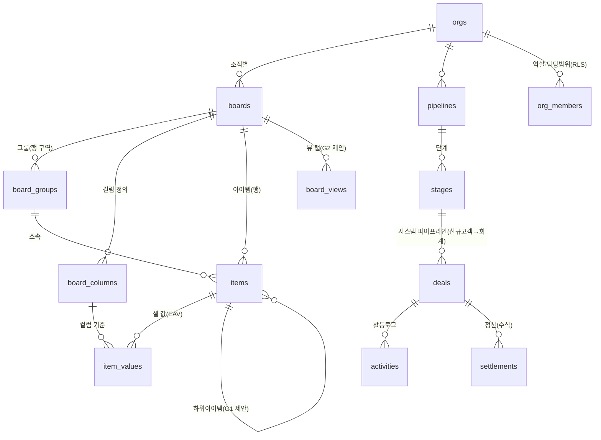

# 먼데이 실측 — 탭·컬럼·버튼 시퀀스 → DB 매핑 v0.1

> 작성: 기획-Cowork 2026-07-21 · 출처: **라이브 API 실측**(신규고객 보드 1816794539: 컬럼 27·그룹 14·뷰 4·자동화 19) + belie 스크린샷 + `먼데이-전체스키마-v1.md`(전 보드 컬럼·선택지 전수) + `001/003` 스키마 대조.
> 원칙: **새 스키마 파일을 만들지 않음**(스키마 정본=기획 세션, ADR-0002). 본 문서는 실측·매핑·갭 목록 → 반영은 기획2가 003 개정/004로.

## 1. 탭(뷰)별 구조 — 실측

**뷰 = 같은 보드 데이터에 "저장된 필터/표시 설정"을 씌운 탭.** 신규고객 보드 4뷰 실측:

| 뷰 탭 | 타입 | 필터 로직(실측) |
|---|---|---|
| 메인 테이블 | TableBoardView | 없음(전체) |
| 박정화님 차트 | TableBoardView | `담당자(status)` ANY_OF [박정화 실장] |
| 제조업DB | TableBoardView | `Name` ANY_OF [제조업 관련 표기 17종 열거] |
| 음식점DB | TableBoardView | `Name` ANY_OF [음식점 표기 30종 열거] |
| 이대표 담당 | TableBoardView | `출동(people)` = assigned_to_me |

⚠️ 관찰: 제조업DB/음식점DB는 **이름 텍스트 열거 필터**(오타 변형 17~30종을 수동 열거) — 데이터 정규화가 안 돼서 생긴 우회. 모아워크에선 `업종/업태` 필드 필터로 대체 가능(교정 옵션, 구조스펙 §7).

컬럼 구조: 전 보드 전수는 `먼데이-전체스키마-v1.md`가 정본(신규고객 26~27·컨텍 24·업무 31·회계 20). 이번 실측으로 보강된 것: 각 상태 라벨의 **hex 색·index·is_done 플래그**, 컬럼 `description`(=자동화 안내문), subitems 연결 보드 ID(1816856300), 뷰 필터 JSON.

## 2. 버튼 시퀀스 카탈로그 (UI → 트리거 → 결과 → 우리 구현)

| UI 요소 | 시퀀스(실측/공식동작) | 우리 DB/구현 매핑 |
|---|---|---|
| **새로운 아이템**(파란 버튼) | 클릭 → 최상단 그룹에 행 생성 → 인라인 이름 입력 | `items` INSERT (003) / 시스템 보드는 `deals` |
| ▾(새 아이템 캐럿) | 그룹 선택해 추가 | 〃 (group_id 지정) |
| **상태 셀 클릭** | 라벨 팔레트 드롭다운 → 선택 → 셀 색·값 변경 | `item_values` UPSERT + `audit_logs` |
| 상태 변경 **→ 그룹 이동 자동화** | "When status changes to X → move item to {group}" (실측 다수) | 하드코딩 자동화: UPDATE `items.group_id` |
| 상태 변경 **→ 보드 이동 자동화** | 컨텍관리 컬럼 desc 실측: "[인계]로 변경하면 [🟢컨텍관리]로 넘어갑니다" | 시스템 파이프라인: `deals.stage_id` 전이(우리는 이동 대신 **단계 전이**로 재현 — 데이터 복사 불필요) |
| 컬럼 변경 **→ 웹훅 자동화** | 실측 1개: "When a column changes, send a webhook" — 📬 컬럼들(부재/AI_1·2·3차)이 외부 발송시스템과 연동된 것으로 추정 | Phase 2 `mod.notify`(알림톡 트리거) + `lead_intake`/워커 웹훅과 동일 패턴 |
| 셀 더블클릭(텍스트/숫자) | 인라인 편집 | `item_values`/`deals` UPDATE |
| **아이템명 클릭** | 우측 상세 패널(업데이트·파일·활동 로그 탭) | 딜 상세(정보/활동/문서 탭) = `activities`·Storage·`audit_logs` |
| 하위아이템 토글 | 행 아래 서브테이블 확장(별도 보드 1816856300, 컬럼 4) | ⚠️ **갭 G1** — 003 `items`에 parent 없음 |
| 그룹 헤더 ▾/제목 | 접기·이름/색 변경 | `board_groups` UPDATE |
| 툴바 검색/사람/필터/정렬/숨기기/그룹 | 화면 임시 필터(저장 안 됨), "뷰로 저장" 선택 시 탭 생성 | 임시=클라이언트 상태 / 저장=**갭 G2**(board_views) |
| 뷰 탭 + | 새 뷰(테이블·칸반·차트…) 생성 | 〃 G2 |
| 자동화/19 버튼 | 자동화 목록·편집기 | MVP=하드코딩(이동·트리거), 편집 UI=`mod.automation`(P3, 스펙 O16) — 의도된 제외 |
| 초대하기/3 | 멤버 초대 모달 | `org_members`(core.org) ✅ 스펙 내 |
| 파일 셀 | 업로드→미리보기 칩 | Storage+`files`(T04 범위) |
| 84% 배너 | 아이템 한도(10,000) 경고 | 우리는 한도 없음(RDB) — 대신 아카이브 정책 권장(§7-5) |

## 2b. 눌러야 나오는 기능(hidden UI) 실측 — belie 스크린샷 2장 (2026-07-21)

**② 컬럼 헤더 「⋯」 메뉴** (모든 컬럼 공통):

| 메뉴 | 동작 | 매핑 |
|---|---|---|
| ⚙️ 설정 › | 컬럼 세부설정(라벨 편집 등) | `board_columns.options_jsonb` UPDATE |
| ✨ 이 컬럼 자동 채우기(AI) | AI 값 채움 | **파킹랏**(AI류 — 제외 확정) |
| 필터 / 정렬 › | 이 컬럼 기준 임시 필터·정렬 | 클라이언트 상태(저장 시 G2 board_views) |
| 축소 | 컬럼 접기(폭 최소화) | 사용자별 UI 상태 → G2 뷰 설정에 포함 |
| 그룹 | 이 컬럼 값으로 그룹핑 | 뷰 설정(G2) |
| 컬럼 복제 / 오른쪽에 컬럼 추가 | 컬럼 CRUD | `board_columns` INSERT |
| 컬럼 유형 변경 | 타입 전환(값 변환 시도) | `board_columns.type` UPDATE(+값 마이그레이션 규칙 필요 — 구현 주의) |
| 이름 바꾸기 / 삭제 | 〃 | `board_columns` UPDATE/DELETE |

**③ 아이템 업데이트 스레드(=채팅형 히스토리, 실사용 핵심!)** — 행마다 말풍선 배지(💬n=업데이트 수), 클릭 시 우측 패널:

- 탭: **업데이트/n · 파일 · 활동 로그 · 아이템 카드 · +**
- 작성기: **리치텍스트**(B/I/U/취소선/목록/링크/체크박스) + **@멘션** + 📎첨부 + 이모지 + ✨AI + [업데이트] 버튼. "이메일을 통한 업데이트" 지원.
- 각 업데이트: 작성자·시각, 본문, **좋아요 · 답변(스레드) · 👁️조회수**, 답글 입력창("@(으)로 멘션").
- 실사용 패턴: 상담원이 통화 결과를 채팅처럼 축적("부재-안내문자남김" 등) — **우리 CRM 활동기록의 실제 모습.**

→ 매핑·갭: 001 `activities`(type·content·actor·at)는 **평면 구조**. 스레드 재현에 필요: 리치텍스트 본문, `parent_activity_id`(답글), reactions(좋아요), 조회수, 멘션, 첨부 연결 = **갭 G6**. 말풍선 배지=아이템별 활동 수 집계. "아이템 카드" 탭=컬럼값 폼 뷰(딜 상세 정보탭 대응). "이메일을 통한 업데이트"=**파킹랏**.

## 3. 자동화 실측 요약 (신규고객 보드 19개)

패턴 3종 확인: ① **status→그룹 이동**(대부분 — 상담상황·컨텍여부 라벨별로 해당 그룹 이동) ② **status→타 보드 이동**(컨텍관리→컨텍관리 보드; 컨텍→업무도 동일 패턴) ③ **컬럼 변경→웹훅**(1개 — 외부 발송기 연동, 📬 컬럼 계열).
전체 19개 원문 JSON은 세션 임시파일로 확보(30K 토큰, 본 세션 예산상 전량 전개 생략) — **다음 기획 세션 할 일: 19개 전수 표(트리거 라벨→대상 그룹) 추출**해 §3에 붙일 것.

## 4. 데이터구조도 (ERD — 먼데이 개념 → 우리 DB)

- **이원 구조(설계 확정, ADR-0003)**: 정책자금 4단계 = typed 코어(`deals` 계열, 수식·RLS 보존) / 사용자 임의 보드 = EAV 엔진(`boards`~`item_values`). 먼데이의 "보드"는 화면상 둘 다 같은 모습.

## 5. 갭 분석 (실측 vs 001+003) — 기획2 반영 요청

| # | 갭 | 실측 근거 | 제안 |
|---|---|---|---|
| G1 | **하위아이템 없음** | 신규고객 subitems 보드(1816856300)·업무관리 커스텀 서브컬럼 7종 | `items.parent_item_id uuid null self-FK` 1컬럼 추가(간단) — belie 승인 시 |
| G2 | **보드 뷰 탭 저장 없음** | 뷰 4개+필터 JSON 실측(001 `saved_views`는 company/deal 전용) | `board_views(board_id, name, type, filters_jsonb, sort_jsonb, columns_jsonb, sort_order)` — belie 승인 시 |
| G3 | 자동화 정의 테이블 없음 | 19개 실측 | **의도된 제외**(MVP=하드코딩 이동/트리거, 편집기=P3 O16). 기록만 |
| G4 | 웹훅 발송 연동 | 웹훅 자동화 1개 | P2 `mod.notify`로 커버 예정. 기록만 |
| G5 | 컬럼 폭·순서·숨김 사용자별 저장 | 스크린샷(컬럼 폭 상이) | `board_columns.width` 있음(003✅) / 사용자별 숨김은 G2 뷰에 포함 |

## 6. 파킹랏 — 스펙에 없는 먼데이 버튼·기능 (위치 기억용, 제거해도 "있었다"는 기록)

| 기능(위치) | 먼데이에서의 역할 | 우리 상태 |
|---|---|---|
| ✨AI 제안(보드 헤더) | AI 추천 액션 | 스펙 외 — 제거 예정(파킹) |
| 🤖 Agents(보드 헤더)·에이전트(레일) | AI 에이전트 실행 | 스펙 외 — 파킹 |
| ⚡사이드킥(레일) | AI 비서 패널 | 스펙 외 — 파킹 |
| 💜 Vibe(레일) | 디자인 시스템 도구 | 스펙 외 — 파킹 |
| 🔀 워크플로우(레일) | 크로스보드 워크플로 빌더 | 스펙 외(P3 mod.automation 인접) — 파킹 |
| 📝 노트 테이커(레일) | 회의 노트 | 스펙 외 — 파킹 |
| 🧩 앱 마켓(탑바) | 서드파티 앱 설치 | 스펙 외(P3 모듈마켓 인접) — 파킹 |
| 연동(보드 헤더) | 외부 서비스 연동 갤러리 | P2 벤더연동으로 부분 대체 — 파킹 |
| 자동화 편집기(보드 헤더) | 레시피 빌더 | P3 O16 — 파킹(§2 참조) |
| 받은편지함/알림(탑바) | 인앱 알림 | MVP 미정(스펙상 명시 없음) — 파킹 |

---
## 7. 동업자(이준우 대표) 요구 대조 — 2026-07-21 카톡

> "카테고리(컬럼) **자유 설정**이 초반 핵심 + **상황클릭 액션** + AI/API 연동은 MVP 제외."

| 대표 요구 | 우리 설계 현황 | 판정 |
|---|---|---|
| 컬럼 자유 설정(드롭다운·텍스트·날짜·연락처·주소·링크·파일·담당자) | 003 임의보드 엔진 + field_type 13종(주소=text로 커버) | ✅ 방향 일치 |
| 업종·진행기관·상품·심사상황 드롭다운 | 002 업종팩 프리셋 + options_jsonb 자유 편집 | ✅ |
| **상황클릭(상태 컬럼)** | ⚠️ enum에 select만 있고 **status 타입 없음**(색 라벨·is_done·액션 트리거는 select와 다름) | **갭 G7 — status 타입 신설** |
| **상황클릭 액션** | 시스템 파이프라인=하드코딩 ✅ / 임의 보드=없음 | **갭 G8 — 단일 레시피 채택(아래)** |
| AI·API 연동 MVP 제외 | PLAN v0.2.2 확정과 일치 | ✅ |

**belie 확정(2026-07-21): G7 status 타입 신설 + G8 "상태→그룹 이동" 단일 레시피 설정형(예: `board_automation_rules(board_id, status_column_key, status_value, to_group_id)`)을 MVP 포함.** 범용 자동화 빌더는 P3 유지(O16). → 기획2 스키마 반영.

### belie 결정 (2026-07-21 확정)
- **파킹랏 §6 전부 제외** — UI·DB에서 빼되 본 문서에 위치 기록 유지(복원 검토용).
- **G1 채택**: `items.parent_item_id`(self-FK) 추가 — 하위아이템 MVP 포함.
- **G2 채택**: `board_views` 테이블 추가 — 뷰 탭 저장 MVP 포함.
- **G6 부분 채택(핵심만)**: 활동 스레드 = 텍스트 업데이트 + **답글**(`activities.parent_activity_id` self-FK) + **말풍선 개수 배지**(집계)까지 MVP. 좋아요·조회수·리치텍스트·멘션·이메일업데이트 = 파킹(P2).

### 다음 액션
- **기획2(스키마 정본 담당)**: G1·G2를 003 개정 또는 004 마이그레이션으로 반영 + 자동화 19개 전수 표 추출(§3) + D15 반영(기존 할 일).
- UI 목업 v0.2: 파킹랏 버튼 제거판(필요 시).
